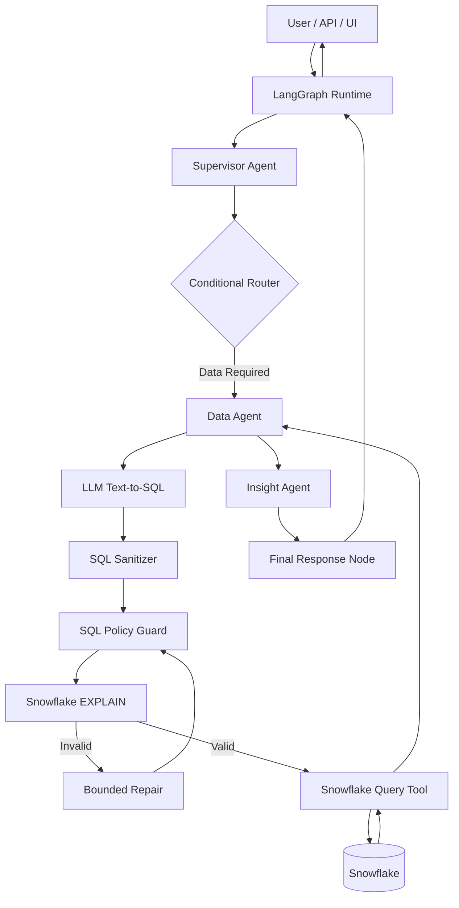
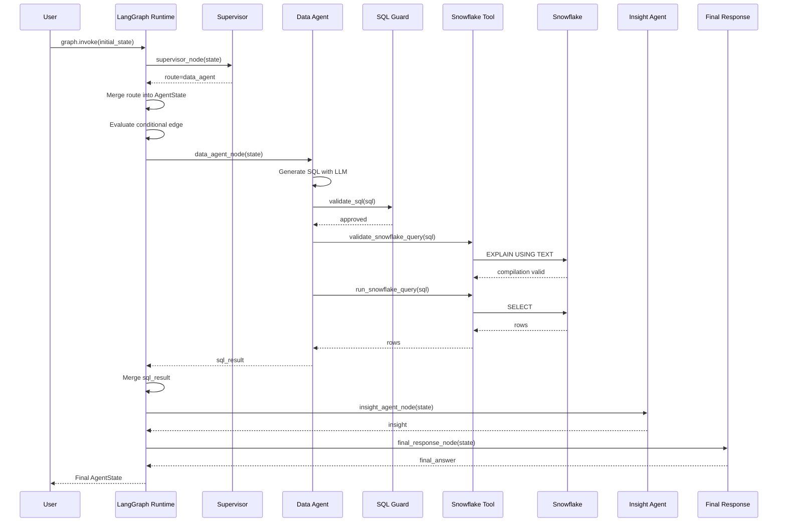

# End-to-End Architecture

This document explains the complete runtime flow of the Snowflake Agentic Intelligence Platform, from user input through LangGraph orchestration, Snowflake execution, AI interpretation, and final response generation.

---

# 1. Purpose

The platform is designed to let users ask natural-language operational questions while keeping enterprise data access governed and deterministic.

Example:

```text
Which support channels have the worst average resolution time?
```

The platform does not send this question directly to Snowflake or let an LLM execute arbitrary SQL.

Instead, it passes through a controlled sequence of components.

---

# 2. End-to-End Request Flow

```text
User Question
    ↓
Initial AgentState
    ↓
LangGraph Runtime
    ↓
Supervisor Agent
    ↓
Conditional Routing
    ↓
Data Agent
    ↓
Text-to-SQL Generation
    ↓
SQL Sanitization
    ↓
SQL Policy Guard
    ↓
Snowflake EXPLAIN Validation
    ↓
Snowflake Query Execution
    ↓
Verified Query Result
    ↓
Insight Agent
    ↓
Final Response Node
    ↓
Final AgentState
    ↓
User Response
```

---

# 3. High-Level Component Diagram



---

# 4. User Input

The user provides a natural-language question.

Example:

```text
Which support channels have the worst average resolution time?
```

At this point, the request is unstructured text.

The application places that question inside the initial workflow state.

Example:

```python
initial_state = {
    "user_question": "Which support channels have the worst average resolution time?",
    "route": None,
    "sql_result": None,
    "insight": None,
    "final_answer": None,
}
```

This becomes the starting state for the graph.

---

# 5. LangGraph Invocation

The graph is started using:

```python
result = graph.invoke(initial_state)
```

Conceptually:

```text
graph.invoke(...)
    ↓
LangGraph runtime starts
    ↓
initial state is loaded
    ↓
START node is entered
```

LangGraph now becomes responsible for deciding which registered node executes next.

---

# 6. Supervisor Agent

The first meaningful node is the Supervisor.

Its purpose is to determine what kind of work is required.

Example input:

```text
Which support channels have the worst average resolution time?
```

The Supervisor understands that this question requires data access.

It returns:

```python
{
    "route": "data_agent"
}
```

The Supervisor does not directly invoke the Data Agent.

It only updates the workflow state.

---

# 7. Runtime State Merge

LangGraph receives the partial state update:

```python
{
    "route": "data_agent"
}
```

and merges it into the existing state.

The state now looks conceptually like:

```python
{
    "user_question": "...",
    "route": "data_agent",
    "sql_result": None,
    "insight": None,
    "final_answer": None
}
```

This state is then passed to the next runtime decision.

---

# 8. Conditional Routing

The conditional edge reads:

```python
state["route"]
```

using a routing function such as:

```python
def route_from_supervisor(state: AgentState):
    return state["route"]
```

If the value is:

```text
data_agent
```

LangGraph follows the configured edge to the Data Agent node.

Conceptually:

```text
Supervisor
    ↓
route = data_agent
    ↓
Conditional Edge
    ↓
Data Agent
```

---

# 9. Data Agent

The Data Agent is responsible for translating the user question into a Snowflake query.

The agent receives:

```text
user question
+
allowed schema
+
allowed columns
+
SQL rules
```

The LLM then generates SQL.

Example:

```sql
SELECT
    TICKET_CHANNEL,
    AVG(RESOLUTION_TIME_HOURS) AS AVG_RESOLUTION_TIME
FROM AI_ENGINEERING_LAB.CURATED.CUSTOMER_SUPPORT_TICKETS
GROUP BY TICKET_CHANNEL
ORDER BY AVG_RESOLUTION_TIME DESC;
```

The SQL is still considered untrusted at this point.

---

# 10. SQL Sanitization

LLMs sometimes return extra prose or markdown.

Example:

```text
Here is your SQL:

```sql
SELECT ...
```

This query calculates...
```

The SQL sanitizer extracts the actual statement before validation.

Conceptually:

```text
Raw LLM Output
    ↓
clean_sql()
    ↓
Pure SELECT Statement
```

---

# 11. SQL Policy Guard

The sanitized SQL passes through deterministic validation.

The guard verifies rules such as:

```text
SELECT only
approved tables only
no INSERT
no UPDATE
no DELETE
no DROP
no ALTER
no CREATE
no MERGE
no TRUNCATE
```

If validation fails:

```text
query rejected
    ↓
safe error returned
```

If validation passes:

```text
query moves to Snowflake validation
```

---

# 12. Snowflake Compilation Validation

Before running the real query, the platform asks Snowflake to validate it using:

```sql
EXPLAIN USING TEXT <query>
```

This catches database-level issues such as:

- ambiguous columns
- invalid identifiers
- invalid joins
- nonexistent columns
- malformed syntax

This is important because an application-level SQL guard cannot fully understand Snowflake semantics.

---

# 13. Bounded SQL Repair

If Snowflake returns a compilation error, the error can be provided back to the LLM.

Example:

```text
SQL compilation error:
ambiguous column name 'TICKET_CHANNEL'
```

The repair prompt includes:

```text
user question
original SQL
Snowflake error
allowed schema
SQL rules
```

The LLM receives one controlled opportunity to repair the query.

The repaired SQL then passes through the full validation chain again.

```text
Repair
  ↓
SQL Guard
  ↓
Snowflake EXPLAIN
  ↓
Execute or Fail
```

Retries remain bounded.

---

# 14. Snowflake Query Tool

Once validation succeeds, the Data Agent calls the Snowflake execution tool.

Conceptually:

```python
result = run_snowflake_query(sql)
```

The tool:

```text
opens Snowflake connection
    ↓
creates cursor
    ↓
executes SELECT
    ↓
fetches rows
    ↓
closes cursor
    ↓
closes connection
    ↓
returns result
```

Example result:

```python
[
    ("Web Form", 39.345061),
    ("Email", 39.257512),
    ("Chat", 39.089198)
]
```

---

# 15. Data Agent State Update

The Data Agent returns:

```python
{
    "sql_result": result
}
```

LangGraph merges this into shared state.

The workflow state now contains both:

```text
user intent
+
verified Snowflake result
```

---

# 16. Insight Agent

The Insight Agent receives the verified Snowflake result.

Its responsibility is not to replace deterministic analytics.

Instead, it provides:

- interpretation
- business context
- prioritization
- recommendation

Example:

```text
Web Form currently has the highest average resolution time,
followed closely by Email and Chat.

Operational attention should prioritize reducing Web Form resolution time.
```

The Insight Agent returns:

```python
{
    "insight": "..."
}
```

---

# 17. Final Response Node

The final response node converts internal workflow output into the user-facing response.

Current implementation:

```python
def final_response_node(state: AgentState):
    return {
        "final_answer": state["insight"]
    }
```

This creates a clean boundary between internal processing and final output.

---

# 18. END Node

After the final-response node completes, LangGraph reaches:

```text
END
```

Execution stops.

`graph.invoke()` returns the final merged state.

Example:

```python
{
    "user_question": "...",
    "route": "data_agent",
    "sql_result": [...],
    "insight": "...",
    "final_answer": "..."
}
```

---

# 19. Runtime Sequence



---

# 20. Responsibility Boundaries

The application deliberately separates responsibilities.

| Component | Responsibility |
|---|---|
| User / UI | Provides natural-language request |
| LangGraph Runtime | Executes workflow |
| AgentState | Carries shared workflow data |
| Supervisor | Determines route |
| Conditional Edge | Selects next node |
| Data Agent | Generates analytical SQL |
| SQL Guard | Enforces SQL policy |
| Snowflake Validation Tool | Checks SQL compilation |
| Snowflake Query Tool | Executes SQL |
| Snowflake | Provides governed data and computation |
| Insight Agent | Interprets verified results |
| Final Response Node | Produces final user response |

---

# 21. Key Architectural Principle

The platform does not treat the LLM as the system.

The LLM is one component inside a larger controlled architecture.

```text
LLM
    → understands and reasons

LangGraph
    → orchestrates

State
    → carries workflow context

Nodes
    → perform workflow steps

Edges
    → control execution flow

Tools
    → perform external actions

Snowflake
    → owns governed data and analytical computation
```

This separation is the foundation of the platform's reliability and extensibility.
```