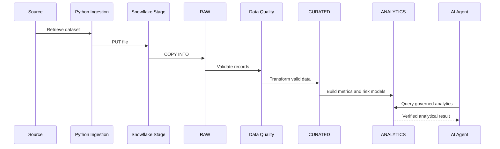

# Data Platform Flow

This document explains how data moves through the Snowflake data platform, from external source ingestion to governed analytics and AI consumption.

The goal of this architecture is to create a reliable data foundation before any AI agent is allowed to reason over enterprise information.

---

# 1. Data Flow Overview

```text
External Source
    ↓
Python Ingestion
    ↓
Snowflake Internal Stage
    ↓
RAW Layer
    ↓
Data Quality Validation
    ↓
CURATED Layer
    ↓
ANALYTICS Layer
    ↓
AI / Agent Consumption
```

The architecture follows an ELT-oriented model.

```text
Extract
→ Load into Snowflake
→ Transform inside Snowflake
```

Snowflake remains the analytical system of record.

---

# 2. Source Layer

The current reference implementation uses a customer support dataset retrieved through the Kaggle API.

Example:

```python
kagglehub.dataset_download(
    "ajverse/customer-support-tickets-crm-dataset"
)
```

The source contains approximately:

```text
20,000 support tickets
```

with attributes such as:

- Ticket ID
- Customer Name
- Customer Email
- Ticket Subject
- Ticket Description
- Issue Category
- Priority Level
- Ticket Channel
- Submission Date
- Resolution Time
- Assigned Agent
- Satisfaction Score

In an enterprise deployment, this source layer could be replaced with:

```text
SAP
CRM
ERP
REST APIs
Object Storage
Operational Databases
Streaming Platforms
SaaS Applications
```

The downstream Snowflake architecture remains largely unchanged.

---

# 3. Python Ingestion Layer

Python is responsible for acquiring source data and moving it into Snowflake staging.

The ingestion component performs tasks such as:

```text
source connection
↓
dataset retrieval
↓
local file discovery
↓
basic file validation
↓
upload to Snowflake stage
```

The ingestion code does not perform heavy analytical transformations.

Those transformations belong inside Snowflake.

---

# 4. Snowflake Internal Stage

The source file is uploaded into a Snowflake internal stage.

Example stage:

```text
@CUSTOMER_SUPPORT_STAGE
```

Conceptually:

```text
Kaggle
    ↓
Python
    ↓
CSV file
    ↓
Snowflake Internal Stage
```

The internal stage provides a controlled landing zone before relational ingestion.

Benefits include:

- separation between file transport and table loading
- replayability
- bulk-loading support
- easier troubleshooting
- decoupling ingestion from table transformation logic

---

# 5. File Format Definition

Snowflake file format objects define how staged files should be interpreted.

Example:

```sql
CREATE FILE FORMAT CUSTOMER_SUPPORT_CSV_FORMAT
TYPE = CSV
FIELD_OPTIONALLY_ENCLOSED_BY = '"'
SKIP_HEADER = 1;
```

This externalizes parsing configuration from the load command.

The same pattern can support:

```text
CSV
JSON
Parquet
Avro
ORC
XML
```

depending on the source format.

---

# 6. RAW Layer

The staged file is loaded into the RAW schema.

Example:

```text
AI_ENGINEERING_LAB.RAW.CUSTOMER_SUPPORT_TICKETS
```

The load uses Snowflake-native bulk ingestion:

```sql
COPY INTO CUSTOMER_SUPPORT_TICKETS
FROM @CUSTOMER_SUPPORT_STAGE
FILE_FORMAT = CUSTOMER_SUPPORT_CSV_FORMAT;
```

The RAW layer preserves source-aligned data with minimal interpretation.

---

# 7. Why Preserve RAW Data

The RAW layer acts as the first persistent system boundary.

Its responsibilities are:

- preserve source fidelity
- support reprocessing
- simplify debugging
- provide lineage
- isolate downstream models from source delivery mechanics

The architecture intentionally avoids immediately overwriting source values with business transformations.

---

# 8. RAW Schema Design

RAW columns typically remain close to the original source representation.

For example:

```text
SUBMISSION_DATE
```

may initially be stored as a string.

This avoids failing ingestion because of malformed values.

Type enforcement occurs later in the CURATED layer.

---

# 9. Data Quality Layer

Before data becomes analytics-ready, explicit validation rules are applied.

Examples include:

```text
Ticket ID uniqueness
Required-field presence
Valid priority values
Satisfaction score range
Non-negative resolution times
Timestamp parseability
```

Example duplicate validation:

```sql
SELECT
    TICKET_ID,
    COUNT(*) AS DUPLICATE_COUNT
FROM AI_ENGINEERING_LAB.RAW.CUSTOMER_SUPPORT_TICKETS
GROUP BY TICKET_ID
HAVING COUNT(*) > 1;
```

The key principle is:

> Data quality is measured explicitly rather than inferred from successful ingestion.

---

# 10. Quality Validation Results

The current dataset produces:

```text
Total rows                  20,000
Duplicate Ticket IDs             0
Invalid priority values          0
Invalid satisfaction scores      0
Negative resolution times        0
Missing required fields          0
Invalid dates                    0
```

A clean source does not eliminate the need for quality controls.

Production systems validate every batch regardless of historical quality.

---

# 11. CURATED Layer

Validated source data is transformed into the CURATED schema.

Example:

```text
AI_ENGINEERING_LAB.CURATED.CUSTOMER_SUPPORT_TICKETS
```

The CURATED layer represents trusted, reusable business data.

Typical transformations include:

- type conversion
- standardization
- validation
- normalization
- filtering invalid records
- reusable business definitions

---

# 12. Type Conversion

Example RAW value:

```text
SUBMISSION_DATE = STRING
```

The CURATED layer can convert it using:

```sql
TRY_TO_TIMESTAMP_NTZ(SUBMISSION_DATE)
```

The use of `TRY_` functions allows the platform to detect malformed values without crashing the complete transformation.

---

# 13. RAW to CURATED Flow

```text
RAW.CUSTOMER_SUPPORT_TICKETS
        ↓
validation
        ↓
type conversion
        ↓
business rules
        ↓
CURATED.CUSTOMER_SUPPORT_TICKETS
```

The CURATED layer is the preferred source for most downstream analytics and AI queries.

---

# 14. ANALYTICS Layer

The ANALYTICS schema contains reusable business-facing models.

Example:

```text
AI_ENGINEERING_LAB.ANALYTICS.SUPPORT_OPERATION_METRICS
```

This layer transforms detailed records into business measures.

Metrics include:

- ticket volume
- average resolution time
- average satisfaction
- high-priority ticket volume
- channel performance
- issue-category performance

---

# 15. Analytical Aggregation

Example:

```sql
SELECT
    ISSUE_CATEGORY,
    TICKET_CHANNEL,
    PRIORITY_LEVEL,
    COUNT(*) AS TICKET_COUNT,
    AVG(RESOLUTION_TIME_HOURS) AS AVG_RESOLUTION_HOURS,
    AVG(SATISFACTION_SCORE) AS AVG_SATISFACTION_SCORE
FROM AI_ENGINEERING_LAB.CURATED.CUSTOMER_SUPPORT_TICKETS
GROUP BY
    ISSUE_CATEGORY,
    TICKET_CHANNEL,
    PRIORITY_LEVEL;
```

This moves repeated business logic into reusable analytical objects.

---

# 16. SLA Risk Model

The analytics layer also contains deterministic operational-risk logic.

Example:

```text
AI_ENGINEERING_LAB.ANALYTICS.SUPPORT_SLA_RISK
```

Risk levels include:

```text
LOW_RISK
MEDIUM_RISK
HIGH_RISK
```

---

# 17. Why SLA Risk Is Deterministic

The platform deliberately keeps SLA classification outside the LLM.

Example rules:

```text
Critical + resolution > 12 hours
    → HIGH_RISK

High + resolution > 24 hours
    → HIGH_RISK

Medium + resolution > 48 hours
    → MEDIUM_RISK

Low satisfaction
    → MEDIUM_RISK
```

These rules are:

- testable
- explainable
- deterministic
- auditable

This is preferable to asking an LLM to decide operational severity where exact rules already exist.

---

# 18. Current SLA Distribution

The current reference dataset produces approximately:

```text
LOW_RISK       12,447
MEDIUM_RISK     5,795
HIGH_RISK       1,758
```

These values become governed inputs for downstream AI interpretation.

---

# 19. AI Consumption Layer

Agents do not normally query source files directly.

They query governed Snowflake objects.

Preferred flow:

```text
Agent
    ↓
CURATED / ANALYTICS
    ↓
Snowflake
```

This ensures the AI layer consumes trusted data contracts.

---

# 20. Data Layer Responsibilities

| Layer | Responsibility |
|---|---|
| Stage | Temporary file landing |
| RAW | Source-aligned persistence |
| Data Quality | Validate source reliability |
| CURATED | Trusted typed business data |
| ANALYTICS | Reusable metrics and business logic |
| AI | AI enrichment and future AI-produced outputs |

---

# 21. Snowflake Features Used

The platform currently demonstrates several Snowflake capabilities.

## Databases and Schemas

Used to isolate logical data responsibilities.

```text
AI_ENGINEERING_LAB
├── RAW
├── CURATED
├── ANALYTICS
└── AI
```

## Internal Stages

Used as the file landing boundary.

## File Formats

Used to centralize parsing rules.

## COPY INTO

Used for bulk ingestion.

## SQL ELT

Used to transform data inside Snowflake.

## INFORMATION_SCHEMA

Available for metadata inspection and future schema discovery.

## EXPLAIN

Used by the agent layer to validate generated SQL.

## Virtual Warehouse

Provides compute for ingestion, transformation, analytics, and agent queries.

---

# 22. Compute Separation

Snowflake separates storage from compute.

Conceptually:

```text
Central Snowflake Storage
         ↓
Virtual Warehouse
         ↓
SQL Processing
```

This architecture allows future workloads to use different compute configurations for:

```text
ETL
BI
Agent Queries
Data Science
Ad Hoc Analytics
```

without duplicating the underlying data.

---

# 23. Data Flow Sequence



---

# 24. Why ELT

The platform prefers Snowflake-centric transformation because:

- compute is close to data
- transformation logic is visible in SQL
- large datasets do not need to move back into Python
- analytical models are reusable
- governance stays centralized
- SQL transformations can be independently tested

Python handles orchestration and external connectivity.

Snowflake handles set-based data processing.

---

# 25. Separation of Data Engineering and AI

The architecture deliberately avoids mixing ingestion logic directly with AI reasoning.

```text
Data Engineering
    ↓
Trusted Data Products
    ↓
AI Agents
```

rather than:

```text
Source Data
    ↓
LLM
    ↓
Uncontrolled Result
```

This is one of the core design decisions of the platform.

---

# 26. Reusability

The customer-support dataset is a reference domain.

The same data architecture can support:

```text
SAP Sales Orders
Procurement Data
Manufacturing Events
Healthcare Operations
Financial Transactions
IT Service Tickets
Supply Chain Events
Commercial Analytics
```

Only the domain-specific data models and business rules need to change.

The platform layers remain:

```text
Stage
→ RAW
→ CURATED
→ ANALYTICS
→ AI
```

---

# 27. Architectural Principle

The data platform is designed so that AI sits on top of governed data products.

```text
Reliable Data
    ↓
Reliable Analytics
    ↓
Controlled AI Reasoning
```

Snowflake provides the data and analytical foundation on which the agentic platform depends.
```