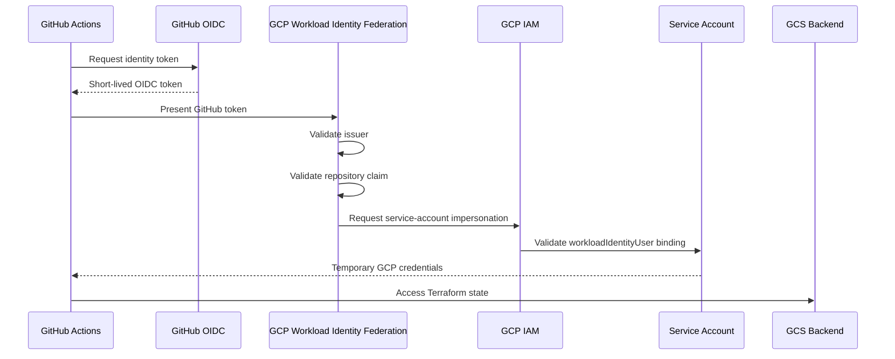
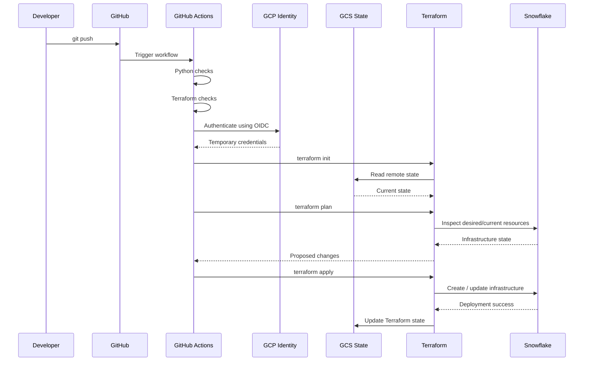

# CI/CD and Infrastructure Flow

This document explains how infrastructure changes move from a developer commit through GitHub Actions, Google Cloud authentication, Terraform remote state, and finally into Snowflake.

The infrastructure delivery design follows three core principles:

- infrastructure is defined as code
- deployment state is centralized
- CI/CD authentication uses short-lived federated credentials instead of long-lived cloud keys

---

# 1. Infrastructure Delivery Overview

```text
Developer
    ↓
Git Commit / Push
    ↓
GitHub
    ↓
GitHub Actions
    ↓
CI Validation
    ↓
OIDC Authentication
    ↓
GCP Workload Identity Federation
    ↓
Temporary Service Account Identity
    ↓
GCS Remote Terraform State
    ↓
Terraform Plan
    ↓
Terraform Apply
    ↓
Snowflake Infrastructure
```

---

# 2. Why Terraform

Terraform is used to define and manage Snowflake infrastructure declaratively.

Instead of manually creating infrastructure objects through the Snowflake UI, the desired configuration is stored in code.

Example:

```hcl
resource "snowflake_database" "ai_engineering_lab" {
  name = "AI_ENGINEERING_LAB"
}
```

Terraform compares:

```text
Desired State
    vs
Current State
```

and generates the required infrastructure changes.

---

# 3. Snowflake Infrastructure Managed by Terraform

The platform uses Terraform to manage core Snowflake objects such as:

```text
AI_ENGINEERING_LAB

├── RAW
├── CURATED
├── ANALYTICS
└── AI
```

Terraform can later be extended to manage additional Snowflake infrastructure such as:

- warehouses
- roles
- grants
- stages
- file formats
- resource monitors
- integration objects

The key goal is to make Snowflake infrastructure reproducible and version-controlled.

---

# 4. Terraform Provider

Terraform communicates with Snowflake through the Snowflake provider.

Conceptually:

```text
Terraform Configuration
        ↓
Snowflake Provider
        ↓
Snowflake API
        ↓
Infrastructure Objects
```

Provider configuration receives Snowflake connection details through Terraform variables.

Sensitive values are not hard-coded into source-controlled Terraform files.

---

# 5. Terraform Variables

Configuration values are passed through Terraform variables.

Example:

```hcl
variable "snowflake_organization" {
  type = string
}

variable "snowflake_account" {
  type = string
}

variable "snowflake_user" {
  type = string
}

variable "snowflake_password" {
  type      = string
  sensitive = true
}
```

During CI/CD, GitHub Actions exposes secrets using:

```text
TF_VAR_snowflake_organization
TF_VAR_snowflake_account
TF_VAR_snowflake_user
TF_VAR_snowflake_password
```

Terraform automatically maps these environment variables to the corresponding Terraform variables.

---

# 6. Why Remote State Is Required

Terraform must remember which real infrastructure objects correspond to the resources in the Terraform configuration.

That mapping is stored in Terraform state.

Without shared state, every new CI runner could incorrectly believe that infrastructure does not exist.

For example:

```text
Snowflake already contains:

AI_ENGINEERING_LAB
```

but a fresh GitHub runner without state may think:

```text
AI_ENGINEERING_LAB does not exist
```

and attempt to create it again.

This is why Terraform state must be shared between environments.

---

# 7. GCS Remote State

Terraform state is stored in Google Cloud Storage.

Backend configuration conceptually looks like:

```hcl
terraform {
  backend "gcs" {
    bucket = "snowflake-tf-state-shubham-2026"
    prefix = "snowflake-engineering-lab/state"
  }
}
```

The state path is therefore logically:

```text
GCS Bucket
    ↓
snowflake-engineering-lab/state
    ↓
Terraform State
```

---

# 8. Why GCS

Google Cloud Storage provides a centralized backend that both:

- local Terraform
- GitHub Actions

can access.

This creates a shared infrastructure view.

```text
Local Developer
        ↓
      GCS
        ↑
GitHub Actions
```

Both operate against the same Terraform state.

---

# 9. State Migration

The project originally used local Terraform state.

That state was migrated to GCS using:

```bash
terraform init -migrate-state
```

Conceptually:

```text
Local terraform.tfstate
        ↓
Migration
        ↓
GCS Backend
```

After migration, Terraform operations read shared state from GCS.

---

# 10. CI vs CD

The pipeline separates validation from deployment.

```text
CI
→ validate code

CD
→ modify infrastructure
```

This distinction is important because validation does not require access to real infrastructure state.

---

# 11. Python CI Job

The Python CI job performs basic application validation.

Current responsibilities include:

```text
Checkout repository
        ↓
Install Python
        ↓
Install dependencies
        ↓
Compile Python source
```

Example:

```bash
python -m compileall python/
```

This detects syntax failures before deployment.

---

# 12. Terraform CI Job

The Terraform validation job performs:

```bash
terraform fmt -check
terraform init -backend=false
terraform validate
```

Each command has a specific purpose.

---

# 13. terraform fmt -check

```bash
terraform fmt -check
```

verifies that Terraform files follow standard formatting.

This provides consistent infrastructure code style across contributors.

---

# 14. terraform init -backend=false

The CI validation job uses:

```bash
terraform init -backend=false
```

instead of:

```bash
terraform init
```

because validation does not need the real GCS backend.

This initializes:

- Terraform modules
- provider plugins

without connecting to the remote state backend.

Conceptually:

```text
CI Validation
    ↓
Terraform Provider Setup
    ↓
No Remote State Access
```

---

# 15. terraform validate

```bash
terraform validate
```

checks the Terraform configuration for structural and syntax errors.

It verifies that:

- resource configuration is valid
- variable references are correct
- provider configuration is structurally valid

before the deployment job begins.

---

# 16. Deployment Job

The deployment job only runs after required CI jobs succeed.

Conceptually:

```text
python-checks ─┐
               ├──> deploy
terraform-checks ─┘
```

This ensures infrastructure deployment does not begin if basic validation fails.

---

# 17. Why GitHub OIDC

A traditional CI/CD integration might store a long-lived GCP service-account key in GitHub Secrets.

That architecture would look like:

```text
GitHub
    ↓
Permanent JSON Key
    ↓
GCP
```

The platform deliberately avoids this model.

Instead:

```text
GitHub
    ↓
Short-Lived OIDC Token
    ↓
GCP Workload Identity Federation
    ↓
Temporary Service Account Credentials
```

No permanent GCP private key is stored in GitHub.

---

# 18. GitHub OIDC Token

GitHub Actions can request an OIDC identity token when the workflow grants:

```yaml
permissions:
  contents: read
  id-token: write
```

`id-token: write` allows the workflow to request a short-lived identity token.

The token contains claims describing the workflow identity.

Relevant claims include information such as:

```text
repository
subject
workflow context
```

---

# 19. Workload Identity Pool

Google Cloud contains a Workload Identity Pool:

```text
github-pool
```

This acts as a trust boundary for external identities.

Conceptually:

```text
External Identity
        ↓
Workload Identity Pool
        ↓
Google Cloud IAM
```

---

# 20. GitHub OIDC Provider

Inside the pool, an OIDC provider is configured for GitHub:

```text
github-provider
```

The issuer is:

```text
https://token.actions.githubusercontent.com/
```

This tells Google Cloud that identity tokens are expected from GitHub's OIDC issuer.

---

# 21. Attribute Mapping

Claims from the GitHub token are mapped into Google Cloud attributes.

Example:

```text
google.subject       ← assertion.sub
attribute.repository ← assertion.repository
```

This allows IAM policies to reason about which repository created the token.

---

# 22. Repository Restriction

The provider trust is restricted to the repository:

```text
SByteForge/snowflake-engineering-lab
```

The goal is to avoid trusting arbitrary GitHub repositories.

Conceptually:

```text
GitHub Token
    ↓
Repository Claim
    ↓
Allowed Repository?
    ├── No → Reject
    └── Yes → Continue
```

---

# 23. Service Account

GitHub Actions impersonates the GCP service account:

```text
github-terraform-cd
```

The full service-account identity is:

```text
github-terraform-cd@project-03c38b46-d98d-4021-bf9.iam.gserviceaccount.com
```

This service account provides the permissions required by Terraform to access the remote state backend.

---

# 24. Workload Identity User Binding

The GitHub repository identity is granted:

```text
roles/iam.workloadIdentityUser
```

on the service account.

This allows:

```text
Trusted GitHub Repository
        ↓
Impersonate Service Account
```

without possessing a service-account private key.

---

# 25. IAM Service Account Credentials API

Service-account impersonation requires the:

```text
IAM Service Account Credentials API
```

This API allows short-lived credentials to be created for the impersonated service account.

Conceptually:

```text
OIDC Identity
    ↓
Authorized Impersonation
    ↓
IAM Credentials API
    ↓
Temporary Credentials
```

---

# 26. GCS Permissions

The service account requires permissions on the Terraform state bucket.

Conceptually:

```text
github-terraform-cd
        ↓
GCS Bucket Permissions
        ↓
Read / Update Terraform State
```

This enables Terraform running in GitHub Actions to access the shared backend.

---

# 27. Authentication Step in GitHub Actions

The deployment workflow authenticates using:

```yaml
- name: Authenticate to Google Cloud
  uses: google-github-actions/auth@v2
  with:
    workload_identity_provider: projects/270391017115/locations/global/workloadIdentityPools/github-pool/providers/github-provider
    service_account: github-terraform-cd@project-03c38b46-d98d-4021-bf9.iam.gserviceaccount.com
```

The action exchanges the GitHub OIDC identity for temporary Google Cloud credentials.

---

# 28. Authentication Flow



---

# 29. Terraform Init in CD

Unlike the CI job, CD runs:

```bash
terraform init
```

without:

```text
-backend=false
```

because deployment must access the real remote state.

Conceptually:

```text
Terraform Init
    ↓
Authenticate to GCP
    ↓
Connect to GCS Backend
    ↓
Read Shared State
```

---

# 30. Terraform Plan

After backend initialization:

```bash
terraform plan
```

compares:

```text
Terraform Configuration
        vs
Remote Terraform State
        vs
Real Snowflake Infrastructure
```

and calculates the proposed change set.

Possible result:

```text
0 to add
0 to change
0 to destroy
```

or:

```text
1 to add
0 to change
0 to destroy
```

depending on the configuration change.

---

# 31. Terraform Apply

If the plan is accepted by the automated deployment:

```bash
terraform apply -auto-approve
```

executes the proposed changes.

Flow:

```text
Terraform Configuration
        ↓
Snowflake Provider
        ↓
Snowflake
        ↓
Infrastructure Updated
```

After successful execution, Terraform updates the remote state in GCS.

---

# 32. Complete Deployment Sequence



---

# 33. Why State and Infrastructure Are Separate

It is important to understand that Terraform state is not the infrastructure itself.

```text
Snowflake
    = real infrastructure

GCS Terraform State
    = Terraform's record of infrastructure

Terraform Code
    = desired infrastructure
```

Terraform reconciles all three.

---

# 34. Example

Suppose Terraform declares:

```text
Schema = ANALYTICS
```

Snowflake already contains:

```text
ANALYTICS
```

and GCS state contains the Terraform resource mapping.

Terraform determines:

```text
No changes required
```

If the state were missing, Terraform might incorrectly attempt to recreate the object.

---

# 35. Security Boundaries

The infrastructure architecture contains multiple security boundaries.

```text
GitHub Repository
    ↓
OIDC identity restriction

Workload Identity Pool
    ↓
external identity trust

Service Account
    ↓
GCP permission boundary

GCS IAM
    ↓
state storage access

Snowflake Credentials
    ↓
Snowflake infrastructure access
```

Each layer has a different responsibility.

---

# 36. Why Snowflake Credentials Still Exist

OIDC solves:

```text
GitHub → Google Cloud
```

authentication.

It does not automatically authenticate Terraform to Snowflake.

Snowflake provider credentials are therefore separately injected using GitHub Secrets.

Conceptually:

```text
GitHub OIDC
    → GCP / GCS access

GitHub Secrets
    → Snowflake provider access
```

These are two different authentication domains.

---

# 37. Separation of CI and Deployment Permissions

A production architecture should minimize permissions.

The CI validation job needs:

```text
repository access
Terraform provider initialization
syntax validation
```

It does not need:

```text
GCS state access
Snowflake infrastructure write permissions
```

The deployment job receives the additional permissions required for actual infrastructure changes.

This follows least-privilege principles.

---

# 38. Failure Scenarios

Several failure modes are deliberately isolated.

## Python Validation Failure

```text
Python compilation fails
    ↓
Deployment never starts
```

## Terraform Validation Failure

```text
Invalid Terraform
    ↓
Deployment never starts
```

## OIDC Failure

```text
GitHub cannot authenticate to GCP
    ↓
Terraform backend cannot initialize
```

## GCS Permission Failure

```text
Authentication succeeds
    ↓
State bucket access denied
    ↓
Terraform init fails
```

## Snowflake Authentication Failure

```text
GCS backend succeeds
    ↓
Snowflake provider cannot authenticate
    ↓
Terraform plan/apply fails
```

Each failure occurs at a clear boundary.

---

# 39. Why This Architecture Is Reusable

The same deployment pattern can support other infrastructure targets.

```text
GitHub
→ OIDC
→ Cloud Identity
→ Terraform
→ Target Platform
```

For this project the target is Snowflake, but the architecture can be extended to:

- GCP
- AWS
- Kubernetes
- Databricks
- other SaaS infrastructure providers

---

# 40. Responsibility Matrix

| Component | Responsibility |
|---|---|
| Git | Version control |
| GitHub | Source repository |
| GitHub Actions | Pipeline runtime |
| OIDC | GitHub workload identity |
| Workload Identity Federation | External identity federation |
| GCP Service Account | Cloud permission identity |
| GCS | Terraform remote state |
| Terraform | Desired-state reconciliation |
| Snowflake Provider | Snowflake API integration |
| Snowflake | Actual data platform infrastructure |

---

# 41. Core Mental Model

```text
Git
    says what changed

GitHub Actions
    decides when automation runs

OIDC
    proves who the workload is

GCP IAM
    decides what that workload may access

GCS
    remembers Terraform state

Terraform
    calculates required infrastructure changes

Snowflake Provider
    executes those changes

Snowflake
    hosts the actual platform
```

---

# 42. Architectural Principle

The infrastructure delivery layer follows:

> Infrastructure should be reproducible, state-aware, automated, and authenticated using short-lived identities.

The resulting deployment architecture avoids manual infrastructure drift while keeping the Snowflake environment connected to version-controlled infrastructure definitions.
