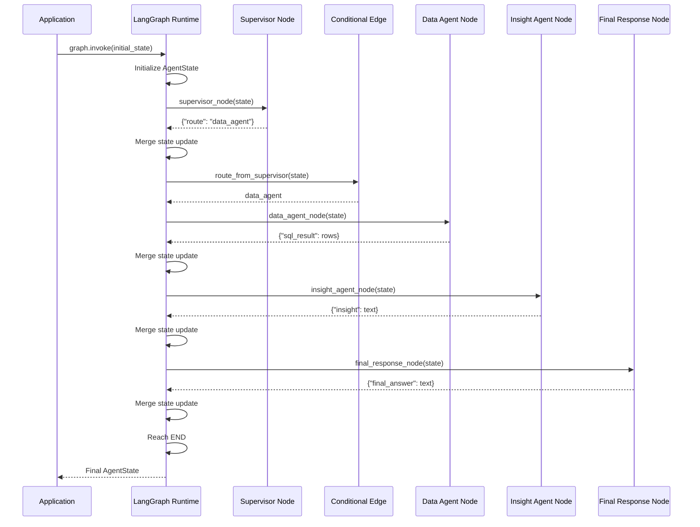

# LangGraph Runtime Internals

This document explains how LangGraph actually executes the agent workflow inside the Snowflake Agentic Intelligence Platform.

The purpose is to make the runtime mechanics explicit:

- what `StateGraph` is
- what `AgentState` is
- how nodes are registered
- how edges control flow
- how conditional edges route execution
- what `START` and `END` represent
- what `compile()` does
- what `invoke()` does
- how state is passed and merged between nodes
- how LangGraph differs from plain Python orchestration

---

# 1. Core Runtime Model

At a high level, LangGraph executes a directed graph.

```text
State
  ↓
Node
  ↓
State Update
  ↓
Edge
  ↓
Next Node
  ↓
State Update
  ↓
...
  ↓
END
```

The graph is not the LLM.

The graph is the orchestration runtime that decides:

```text
which node runs
when it runs
what state it receives
what state update it returns
which edge is followed next
when execution stops
```

---

# 2. Plain Python vs LangGraph

Before LangGraph, the workflow was manually orchestrated.

Example:

```python
supervisor_result = supervisor_node(state)
state.update(supervisor_result)

if state["route"] == "data_agent":
    data_result = data_agent_node(state)
    state.update(data_result)

insight_result = insight_agent_node(state)
state.update(insight_result)
```

The application itself was responsible for:

```text
calling functions
updating state
checking conditions
deciding next steps
```

With LangGraph:

```python
result = graph.invoke(initial_state)
```

the runtime performs that orchestration.

Conceptually:

```text
Plain Python

application code
    ↓
manual function calls
    ↓
manual state updates
    ↓
manual if / else

LangGraph

graph runtime
    ↓
node execution
    ↓
automatic state merging
    ↓
edge-based routing
```

---

# 3. StateGraph

The graph begins with:

```python
from langgraph.graph import StateGraph

builder = StateGraph(AgentState)
```

`StateGraph` is the graph definition object.

It knows:

```text
what type of state the workflow uses
which nodes exist
which edges connect those nodes
where execution starts
where execution ends
```

At this stage, the graph is only a definition.

It is not yet executable.

---

# 4. AgentState

The graph uses a shared state structure.

Example:

```python
class AgentState(TypedDict):
    user_question: str
    route: Optional[str]
    sql_result: Optional[Any]
    insight: Optional[str]
    final_answer: Optional[str]
```

`AgentState` defines the expected shape of workflow state.

Conceptually:

```text
AgentState
=
shared working data structure
used by the graph
```

It is not an agent.

It is not a database.

It is not a node.

It is simply the structure carrying workflow information.

---

# 5. Initial State

Execution begins with an initial state.

Example:

```python
initial_state = {
    "user_question": "Which support channels have the worst average resolution time?",
    "route": None,
    "sql_result": None,
    "insight": None,
    "final_answer": None,
}
```

This is passed to:

```python
graph.invoke(initial_state)
```

At this point:

```text
user_question
    is populated

route
sql_result
insight
final_answer
    are not yet populated
```

---

# 6. Nodes

A LangGraph node is an executable function registered in the graph.

Example:

```python
builder.add_node(
    "supervisor",
    supervisor_node
)
```

This means:

```text
register Python function:

supervisor_node

under graph node name:

supervisor
```

The node name and Python function name do not have to be identical.

---

# 7. Node Function Shape

A typical node looks like:

```python
def supervisor_node(state: AgentState):
    ...
    return {
        "route": route
    }
```

The function receives:

```text
current shared state
```

and returns:

```text
a partial state update
```

It does not need to return the entire state.

---

# 8. Partial State Updates

Suppose the current state is:

```python
{
    "user_question": "Which channels are slowest?",
    "route": None,
    "sql_result": None,
    "insight": None,
    "final_answer": None
}
```

The supervisor returns:

```python
{
    "route": "data_agent"
}
```

LangGraph merges this update.

The new state becomes:

```python
{
    "user_question": "Which channels are slowest?",
    "route": "data_agent",
    "sql_result": None,
    "insight": None,
    "final_answer": None
}
```

This is one of the most important runtime behaviors.

---

# 9. Who Merges State?

The node itself does not call:

```python
state.update(...)
```

LangGraph performs the merge.

Conceptually:

```text
Node receives state
        ↓
Node returns partial update
        ↓
LangGraph runtime receives update
        ↓
LangGraph merges update into current state
        ↓
Updated state becomes input to next step
```

---

# 10. START

LangGraph provides a special:

```python
START
```

marker.

Example:

```python
builder.add_edge(
    START,
    "supervisor"
)
```

This means:

```text
when graph execution begins
    ↓
first execute supervisor
```

`START` is not a normal Python function.

It is a graph control marker representing the entry point.

---

# 11. END

Similarly:

```python
END
```

represents workflow termination.

Example:

```python
builder.add_edge(
    "final_response",
    END
)
```

means:

```text
after final_response completes
    ↓
stop graph execution
```

`END` is a runtime marker, not an agent.

---

# 12. Normal Edge

A normal edge defines an unconditional transition.

Example:

```python
builder.add_edge(
    "data_agent",
    "insight_agent"
)
```

This means:

```text
whenever data_agent completes successfully
    ↓
next execute insight_agent
```

No routing decision is required.

---

# 13. Conditional Edge

A conditional edge chooses the next node dynamically.

Example:

```python
builder.add_conditional_edges(
    "supervisor",
    route_from_supervisor,
    {
        "data_agent": "data_agent",
        "final": END,
    },
)
```

This tells LangGraph:

```text
after supervisor runs
    ↓
call route_from_supervisor(state)
    ↓
look at returned value
    ↓
follow matching route
```

---

# 14. Conditional Edge Decision Function

The routing function is:

```python
def route_from_supervisor(state: AgentState):
    return state["route"]
```

Suppose the current state contains:

```python
{
    "route": "data_agent"
}
```

The function returns:

```text
data_agent
```

LangGraph then checks the mapping:

```python
{
    "data_agent": "data_agent",
    "final": END
}
```

and follows:

```text
data_agent
→ data_agent node
```

---

# 15. Supervisor and Conditional Edge Relationship

The Supervisor does not directly call the Data Agent.

Instead:

```text
Supervisor
    ↓
writes route into state
    ↓
LangGraph merges route
    ↓
Conditional Edge reads route
    ↓
LangGraph selects next node
```

This separation is important.

The Supervisor decides intent.

The graph decides execution.

---

# 16. Runtime Flow Example

Given:

```text
Which support channels have the worst average resolution time?
```

the runtime behaves like:

```text
START
  ↓
Supervisor Node
  ↓
returns:
route = data_agent
  ↓
LangGraph merges state
  ↓
Conditional Edge
  ↓
reads:
state["route"]
  ↓
returns:
data_agent
  ↓
LangGraph follows edge
  ↓
Data Agent Node
```

---

# 17. Data Agent Node Execution

The Data Agent receives the entire current state.

Example:

```python
def data_agent_node(state: AgentState):
    question = state["user_question"]
```

It can access values previously created by other nodes.

For example:

```text
user_question
route
```

are already present.

The Data Agent then:

```text
generates SQL
validates SQL
calls Snowflake tool
receives rows
```

and returns:

```python
{
    "sql_result": result
}
```

---

# 18. State After Data Agent

Before:

```python
{
    "user_question": "...",
    "route": "data_agent",
    "sql_result": None,
    "insight": None,
    "final_answer": None
}
```

Data Agent returns:

```python
{
    "sql_result": [
        ("Web Form", 39.345061),
        ("Email", 39.257512),
        ("Chat", 39.089198)
    ]
}
```

Runtime merges the update.

After:

```python
{
    "user_question": "...",
    "route": "data_agent",
    "sql_result": [
        ("Web Form", 39.345061),
        ("Email", 39.257512),
        ("Chat", 39.089198)
    ],
    "insight": None,
    "final_answer": None
}
```

---

# 19. Insight Agent Node

The graph contains:

```python
builder.add_edge(
    "data_agent",
    "insight_agent"
)
```

Therefore after Data Agent completes:

```text
LangGraph
    ↓
passes updated AgentState
    ↓
Insight Agent
```

The Insight Agent reads:

```python
state["user_question"]
state["sql_result"]
```

and produces:

```python
{
    "insight": "..."
}
```

---

# 20. Final Response Node

The graph then executes:

```text
Insight Agent
    ↓
Final Response Node
```

The final node can return:

```python
{
    "final_answer": state["insight"]
}
```

The state becomes complete.

---

# 21. Complete State Evolution

The state changes progressively.

## Initial

```python
{
    "user_question": "...",
    "route": None,
    "sql_result": None,
    "insight": None,
    "final_answer": None
}
```

## After Supervisor

```python
{
    "user_question": "...",
    "route": "data_agent",
    "sql_result": None,
    "insight": None,
    "final_answer": None
}
```

## After Data Agent

```python
{
    "user_question": "...",
    "route": "data_agent",
    "sql_result": [...],
    "insight": None,
    "final_answer": None
}
```

## After Insight Agent

```python
{
    "user_question": "...",
    "route": "data_agent",
    "sql_result": [...],
    "insight": "...",
    "final_answer": None
}
```

## After Final Response

```python
{
    "user_question": "...",
    "route": "data_agent",
    "sql_result": [...],
    "insight": "...",
    "final_answer": "..."
}
```

---

# 22. Graph Definition

The graph is constructed before execution.

Conceptually:

```python
builder = StateGraph(AgentState)

builder.add_node(
    "supervisor",
    supervisor_node
)

builder.add_node(
    "data_agent",
    data_agent_node
)

builder.add_node(
    "insight_agent",
    insight_agent_node
)

builder.add_node(
    "final_response",
    final_response_node
)

builder.add_edge(
    START,
    "supervisor"
)

builder.add_conditional_edges(
    "supervisor",
    route_from_supervisor,
    {
        "data_agent": "data_agent",
        "final": END,
    },
)

builder.add_edge(
    "data_agent",
    "insight_agent"
)

builder.add_edge(
    "insight_agent",
    "final_response"
)

builder.add_edge(
    "final_response",
    END
)
```

At this point:

```text
graph topology exists
but graph is not yet executable
```

---

# 23. compile()

The graph is converted into an executable runtime using:

```python
graph = builder.compile()
```

Conceptually:

```text
StateGraph definition
    ↓
compile()
    ↓
Executable graph runtime
```

`compile()` validates and prepares:

```text
node registrations
edge relationships
conditional routing
state structure
runtime execution plan
```

---

# 24. builder vs graph

This distinction is important.

```text
builder
=
graph definition

graph
=
compiled executable runtime
```

Example:

```python
builder = StateGraph(AgentState)

...

graph = builder.compile()
```

You define on `builder`.

You execute through `graph`.

---

# 25. invoke()

Execution starts using:

```python
result = graph.invoke(initial_state)
```

`invoke()` means:

```text
run this graph once
using this initial state
and return the final state
```

Conceptually:

```text
initial_state
    ↓
graph.invoke()
    ↓
LangGraph runtime loop
    ↓
START
    ↓
nodes + edges
    ↓
END
    ↓
final state
```

---

# 26. What LangGraph Runtime Actually Does

A simplified internal model is:

```python
state = initial_state

current_node = START

while current_node != END:

    next_node = resolve_edge(current_node, state)

    update = execute_node(next_node, state)

    state = merge(state, update)

    current_node = next_node

return state
```

The real runtime is more sophisticated, but this mental model explains the core behavior.

---

# 27. Is LangGraph Runtime an Object?

Yes.

After:

```python
graph = builder.compile()
```

`graph` is an executable Python object representing the compiled graph.

When you call:

```python
graph.invoke(...)
```

you are calling a method on that runtime object.

This runtime object contains the graph execution logic.

---

# 28. Who Calls the Node Functions?

LangGraph runtime does.

You do not manually call:

```python
supervisor_node(state)
```

during normal graph execution.

Instead:

```text
graph.invoke()
    ↓
LangGraph runtime
    ↓
runtime decides supervisor should run
    ↓
runtime calls supervisor_node(state)
```

---

# 29. Does the LLM Run the Nodes?

No.

The LLM may be called inside a node.

Example:

```text
LangGraph Runtime
    ↓
Supervisor Node
    ↓
Python function executes
    ↓
Python function calls LLM
    ↓
LLM returns routing decision
```

The LLM is not the runtime.

---

# 30. Does the Agent Execute Tools Directly?

In the current implementation, the Data Agent Python function directly calls:

```python
run_snowflake_query(sql)
```

Conceptually:

```text
Data Agent Node
    ↓
Python Tool Function
    ↓
Snowflake
```

This is valid, but it is different from a dedicated LangGraph `ToolNode`.

A future architecture could separate:

```text
Agent Node
    ↓
Tool Request
    ↓
Tool Node
    ↓
Actual Tool Function
```

---

# 31. Node vs Agent

Not every node is an agent.

A node is simply:

```text
an executable graph step
```

Examples:

```text
Supervisor Node
    = LLM-driven agent node

Data Agent Node
    = LLM + deterministic logic

Insight Agent Node
    = LLM-driven reasoning

Final Response Node
    = deterministic Python node
```

Therefore:

```text
Agent Node ⊂ Node
```

An agent can be represented as a node, but not every node is an agent.

---

# 32. Tool vs Tool Node

A tool is an executable capability.

Example:

```python
run_snowflake_query(sql)
```

A Tool Node is a graph node responsible for executing tools.

Conceptually:

```text
Tool
=
actual function

Tool Node
=
graph execution component that invokes tool functions
```

Current implementation:

```text
Data Agent Node
    ↓
Snowflake Tool
```

Possible future implementation:

```text
Data Agent Node
    ↓
Tool Call Request
    ↓
Tool Node
    ↓
Snowflake Tool
```

---

# 33. Edge vs Conditional Edge

## Edge

Always follows one path.

```text
Data Agent
    ↓
Insight Agent
```

## Conditional Edge

Chooses among possible paths.

```text
Supervisor
    ↓
route?
  /     \
Data   END
```

---

# 34. Why Explicit Graphs Matter

Agentic workflows can become difficult to reason about when control flow is hidden inside prompts or nested function calls.

LangGraph makes control flow explicit.

You can see:

```text
what nodes exist
which paths exist
where decisions happen
where tools execute
where the graph ends
```

This improves:

- debuggability
- testability
- observability
- failure isolation
- interview explainability
- production governance

---

# 35. Runtime Sequence Diagram



---

# 36. Runtime Responsibility Matrix

| Component | Responsibility |
|---|---|
| `StateGraph` | Defines graph structure |
| `AgentState` | Defines shared state shape |
| Node | Executes one workflow step |
| Edge | Defines unconditional transition |
| Conditional Edge | Determines dynamic transition |
| `START` | Graph entry point |
| `END` | Graph termination point |
| `compile()` | Produces executable runtime |
| `invoke()` | Executes graph once |
| LangGraph Runtime | Calls nodes and merges state |
| LLM | Performs semantic reasoning inside nodes |
| Tool | Performs external action |

---

# 37. Complete Mental Model

```text
Application
    ↓
graph.invoke(initial_state)

LangGraph Runtime
    ↓
START

Supervisor Node
    ↓
LLM reasoning
    ↓
returns route

LangGraph Runtime
    ↓
merge route into state

Conditional Edge
    ↓
reads route

LangGraph Runtime
    ↓
select next node

Data Agent Node
    ↓
LLM SQL generation
    ↓
Tool execution
    ↓
returns sql_result

LangGraph Runtime
    ↓
merge sql_result

Insight Agent Node
    ↓
LLM interpretation
    ↓
returns insight

LangGraph Runtime
    ↓
merge insight

Final Response Node
    ↓
returns final_answer

LangGraph Runtime
    ↓
END
    ↓
final AgentState
```

---

# 38. Architectural Principle

The most important principle is:

> LangGraph controls workflow execution; agents perform reasoning; tools perform real actions; state carries information between them.

That distinction prevents common confusion between:

```text
LLM
agent
node
tool
tool node
state
edge
runtime
```

and makes the application easier to design, debug, and extend.
```