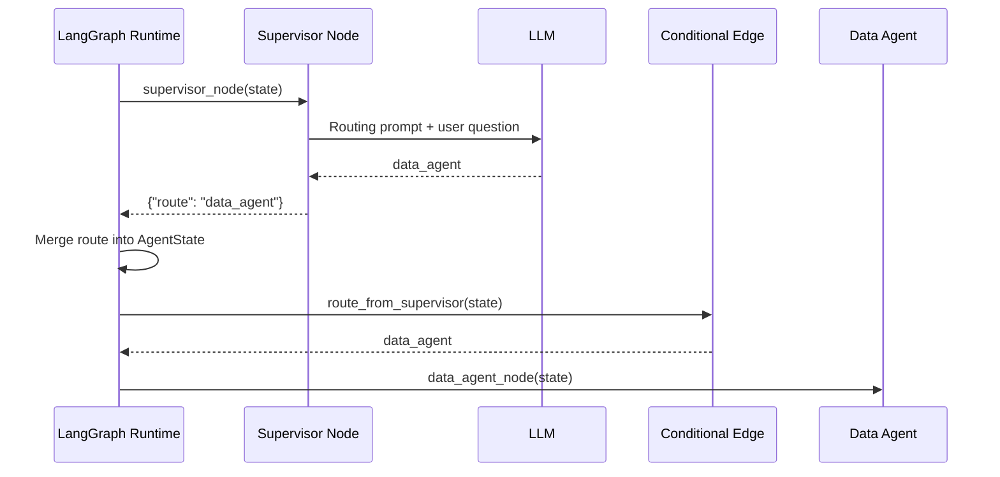

# Supervisor Routing Flow

This document explains how the Supervisor Agent interprets a user request, writes a routing decision into shared state, and how LangGraph converts that decision into the next execution step.

The Supervisor is responsible for **decision-making**, not direct execution.

Its role is to answer:

> What should happen next?

---

# 1. Purpose of the Supervisor

The Supervisor is the first reasoning component in the agent graph.

It receives the current workflow state, reads the user question, and decides which route should be taken.

Example user question:

```text
Which support channels have the worst average resolution time?
```

The Supervisor determines that this requires data access and returns:

```text
data_agent
```

It does not directly execute SQL.

It does not directly call Snowflake.

It does not produce the final business answer.

---

# 2. Supervisor Position in the Graph

```text
START
  ↓
Supervisor Agent
  ↓
Conditional Edge
  ↓
Next Node
```

The Supervisor sits immediately after `START`.

Its output becomes an input to LangGraph routing.

---

# 3. Supervisor Input

The Supervisor receives the shared `AgentState`.

Example:

```python
{
    "user_question": "Which support channels have the worst average resolution time?",
    "route": None,
    "sql_result": None,
    "insight": None,
    "final_answer": None
}
```

The relevant field is:

```python
state["user_question"]
```

---

# 4. Supervisor Function

A simplified implementation looks like:

```python
from agent_state import AgentState
from llm_client import call_llm


def supervisor_node(state: AgentState):
    question = state["user_question"]

    prompt = f"""
You are a routing supervisor for a support analytics system.

User question:
{question}

Available routes:

1. data_agent
   Use when the question requires querying support data,
   SLA risk, ticket counts, categories, channels,
   agents, satisfaction, resolution time,
   or operational metrics.

2. final
   Use when the question does not require querying support data.

Return ONLY one value:

data_agent

or

final
"""

    route = call_llm(prompt).strip().lower()

    if route not in {"data_agent", "final"}:
        route = "final"

    return {
        "route": route
    }
```

---

# 5. What the Supervisor Actually Does

The function performs four steps:

```text
Read user question
    ↓
Build routing prompt
    ↓
Call LLM
    ↓
Return route update
```

The important output is:

```python
{
    "route": "data_agent"
}
```

---

# 6. Why the Supervisor Uses an LLM

A hard-coded router might use:

```python
if "sla" in question:
    route = "data_agent"
```

This works only for known keywords.

It may fail for questions such as:

```text
Which channels are performing poorly?
```

or:

```text
Where are customer response times weakest?
```

These questions may require data access even though they do not contain obvious keywords.

The LLM provides semantic understanding.

---

# 7. LLM Routing vs Execution

The LLM only chooses the route.

It does not perform the route.

Example:

```text
LLM Output
    ↓
"data_agent"
```

The runtime still decides what happens next.

This distinction is important:

```text
LLM
    decides

LangGraph
    routes

Node
    executes
```

---

# 8. Route Validation

LLM outputs are probabilistic.

The model might return:

```text
I recommend using the data_agent.
```

instead of:

```text
data_agent
```

The current code validates the result:

```python
if route not in {"data_agent", "final"}:
    route = "final"
```

This prevents unexpected model output from breaking graph routing.

---

# 9. Why Fallback to final

A safe fallback is used when the LLM returns an unsupported route.

Conceptually:

```text
LLM route
    ↓
Allowed?
  /     \
Yes      No
 |        |
Use      fallback
route    to final
```

This avoids executing an unknown node.

---

# 10. Supervisor Output Is Partial State

The Supervisor does not return the entire `AgentState`.

It returns:

```python
{
    "route": "data_agent"
}
```

This is a partial update.

LangGraph merges it into the existing state.

---

# 11. State Before Supervisor

```python
{
    "user_question": "Which support channels have the worst average resolution time?",
    "route": None,
    "sql_result": None,
    "insight": None,
    "final_answer": None
}
```

---

# 12. Supervisor Return

```python
{
    "route": "data_agent"
}
```

---

# 13. State After Merge

LangGraph produces:

```python
{
    "user_question": "Which support channels have the worst average resolution time?",
    "route": "data_agent",
    "sql_result": None,
    "insight": None,
    "final_answer": None
}
```

The route is now part of shared state.

---

# 14. Conditional Edge Function

The graph defines a routing function:

```python
def route_from_supervisor(state: AgentState):
    return state["route"]
```

This function reads the Supervisor's decision from state.

If:

```python
state["route"] == "data_agent"
```

then the function returns:

```text
data_agent
```

---

# 15. Conditional Edge Mapping

The graph registers:

```python
builder.add_conditional_edges(
    "supervisor",
    route_from_supervisor,
    {
        "data_agent": "data_agent",
        "final": END,
    },
)
```

This means:

```text
if routing function returns "data_agent"
    → execute data_agent node

if routing function returns "final"
    → go to END
```

---

# 16. Complete Routing Flow

```text
User Question
    ↓
Supervisor Node
    ↓
LLM
    ↓
route = data_agent
    ↓
Supervisor returns partial state
    ↓
LangGraph merges state
    ↓
Conditional Edge reads state["route"]
    ↓
route_from_supervisor() returns data_agent
    ↓
Mapping resolves next node
    ↓
Data Agent executes
```

---

# 17. Sequence Diagram



---

# 18. Supervisor Does Not Call Data Agent

This is a critical architectural distinction.

The Supervisor does not do:

```python
data_agent_node(state)
```

Instead:

```text
Supervisor
    ↓
writes route

LangGraph
    ↓
reads route

Conditional Edge
    ↓
selects Data Agent
```

This keeps routing separate from execution.

---

# 19. Why Separate Routing From Execution

This separation improves:

- observability
- testability
- maintainability
- extensibility
- failure handling

The routing decision can be inspected independently from downstream execution.

---

# 20. Example 1: Analytical Question

User asks:

```text
Which categories have the highest SLA risk?
```

Supervisor reasoning:

```text
Question requires Snowflake analytics
```

Output:

```text
data_agent
```

Flow:

```text
Supervisor
    ↓
Conditional Edge
    ↓
Data Agent
```

---

# 21. Example 2: Non-Data Question

User asks:

```text
What can this platform do?
```

Supervisor could return:

```text
final
```

Flow:

```text
Supervisor
    ↓
Conditional Edge
    ↓
END
```

In a more complete architecture, this path could route to a dedicated conversational or knowledge agent instead of directly to `END`.

---

# 22. Current Routing Model

The current routing space is intentionally small:

```text
data_agent
final
```

This keeps the first graph predictable.

As the system grows, the Supervisor could route to:

```text
data_agent
policy_rag_agent
reporting_agent
root_cause_agent
workflow_agent
final
```

The graph does not need to be redesigned from scratch.

Only routing options and nodes need to be extended.

---

# 23. Future Multi-Agent Routing

A future Supervisor could produce:

```text
analytics
policy_lookup
root_cause_analysis
action_execution
```

and LangGraph could map them to specialized agents.

Example:

```text
                    Supervisor
                         ↓
                    route decision
          ┌──────────────┼──────────────┐
          ↓              ↓              ↓
      Data Agent     RAG Agent      Action Agent
```

The same routing architecture remains valid.

---

# 24. Supervisor as an Agent Node

The Supervisor is both:

```text
a LangGraph node
```

and:

```text
an LLM-driven agent
```

This means:

```text
Node
    describes its role in the graph

Agent
    describes its reasoning behavior
```

---

# 25. Responsibility Boundary

The Supervisor owns:

```text
intent understanding
route selection
```

It does not own:

```text
SQL generation
Snowflake execution
data interpretation
final response formatting
```

Those responsibilities belong to other components.

---

# 26. Why This Matters

A common anti-pattern is to create one large agent that:

```text
understands intent
generates SQL
executes SQL
interprets results
writes final answer
```

This makes failures difficult to isolate.

The platform instead separates:

```text
Supervisor
    → routing

Data Agent
    → query planning

Tool
    → execution

Insight Agent
    → interpretation
```

This is easier to reason about and govern.

---

# 27. Runtime Mental Model

Think of the Supervisor flow as:

```python
route_update = supervisor_node(state)

state = runtime_merge(state, route_update)

route = route_from_supervisor(state)

next_node = mapping[route]

runtime_execute(next_node)
```

LangGraph performs these runtime operations automatically.

---

# 28. Routing Is State-Driven

The conditional edge does not ask the LLM again.

It simply reads the decision already stored in state.

```text
Supervisor LLM
    ↓
route stored in state
    ↓
Conditional Edge
    ↓
deterministic lookup
```

This is important because the graph routing step itself remains deterministic after the LLM decision.

---

# 29. Deterministic Routing Boundary

The architecture intentionally separates:

```text
Probabilistic decision
    ↓
LLM chooses route

Deterministic execution
    ↓
LangGraph maps route to node
```

This reduces ambiguity inside the orchestration runtime.

---

# 30. Failure Scenarios

## Invalid LLM Output

Example:

```text
Use data_agent because this is an analytical question.
```

Current behavior:

```text
route validation fails
    ↓
fallback route used
```

---

## Unsupported Route

Example:

```text
finance_agent
```

if the graph does not have such a route.

Behavior:

```text
reject / fallback
```

rather than trying to execute an undefined node.

---

## LLM Unavailable

If the LLM call fails, the Supervisor cannot produce a route.

A production implementation should add:

- exception handling
- retry policy
- deterministic fallback
- tracing
- failure metrics

---

# 31. Observability Opportunity

The Supervisor decision should eventually be stored with metadata such as:

```text
route
model
latency
confidence
reason
timestamp
```

This allows questions such as:

```text
How often does the Supervisor route incorrectly?

Which requests are most difficult to classify?

How much latency is spent in routing?
```

---

# 32. Structured Output

A stronger implementation could require the LLM to return structured output:

```json
{
  "route": "data_agent",
  "reason": "The question requires analytical data from Snowflake."
}
```

The application could validate this using a schema.

This reduces reliance on free-form strings.

---

# 33. Human-in-the-Loop Extension

Certain routes could require human approval.

Example:

```text
Supervisor
    ↓
route = action_agent
    ↓
Human Approval
    ↓
Action Tool
```

LangGraph can represent this as another controlled graph path.

---

# 34. Supervisor Design Principle

The Supervisor should remain lightweight.

Its job is not to solve the user's problem.

Its job is to answer:

> Which component should solve the user's problem?

---

# 35. Responsibility Matrix

| Component | Responsibility |
|---|---|
| Supervisor LLM | Understand intent |
| Supervisor Node | Execute routing logic |
| AgentState | Store routing result |
| LangGraph Runtime | Merge state |
| Conditional Edge | Read route |
| Route Mapping | Resolve next node |
| Data Agent | Perform downstream analytics workflow |

---

# 36. Core Mental Model

```text
User Question
    ↓
Supervisor Agent
    ↓
"What kind of request is this?"
    ↓
route
    ↓
AgentState
    ↓
Conditional Edge
    ↓
"Where does this route go?"
    ↓
Next Node
```

---

# 37. Architectural Principle

> The Supervisor decides the route; LangGraph executes the route.

This distinction is central to understanding the platform's agent orchestration model.
```

