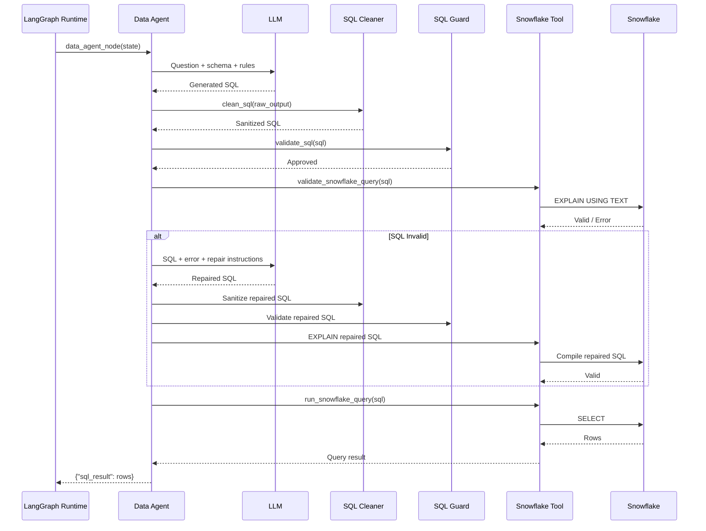

# Data Agent and Text-to-SQL Flow

This document explains how the Data Agent converts a natural-language analytical question into governed Snowflake SQL.

The Data Agent is one of the most important components in the platform because it sits between probabilistic LLM reasoning and deterministic database execution.

Its responsibility is not merely to generate SQL.

Its responsibility is to generate SQL that is:

- relevant to the user's intent
- constrained to approved Snowflake objects
- syntactically valid
- safe to execute
- validated before execution
- repairable within bounded limits
- returned as a verified result into shared agent state

---

# 1. Position in the Agent Graph

The Data Agent executes after the Supervisor routes the request to:

```text
data_agent
```

The graph flow is:

```text
User Question
    ↓
Supervisor
    ↓
Conditional Edge
    ↓
Data Agent
    ↓
Snowflake
    ↓
Insight Agent
```

Internally, however, the Data Agent contains several additional stages.

---

# 2. Internal Data Agent Flow

```text
User Question
    ↓
Schema Context
    ↓
Prompt Construction
    ↓
LLM Text-to-SQL
    ↓
SQL Sanitization
    ↓
SQL Policy Guard
    ↓
Snowflake EXPLAIN Validation
    ↓
Valid?
  /      \
Yes       No
 |         |
Execute   Repair Once
 |         |
 |       Revalidate
 |         |
 └─────────┘
    ↓
Snowflake Query Result
    ↓
AgentState Update
```

The Data Agent therefore combines:

```text
probabilistic generation
+
deterministic validation
+
database-native validation
+
controlled execution
```

---

# 3. Input to the Data Agent

The Data Agent receives the complete current `AgentState`.

Example:

```python
{
    "user_question": "Which support channels have the worst average resolution time?",
    "route": "data_agent",
    "sql_result": None,
    "insight": None,
    "final_answer": None
}
```

The primary input is:

```python
state["user_question"]
```

Example:

```text
Which support channels have the worst average resolution time?
```

---

# 4. Why the Data Agent Needs Schema Context

An LLM does not automatically know the exact schema of the Snowflake environment.

Without schema context, it may generate columns such as:

```text
resolution_time_seconds
risk_level
sla_name
```

even when those columns do not exist.

The Data Agent therefore provides the LLM with explicit schema information.

Example:

```text
AI_ENGINEERING_LAB.CURATED.CUSTOMER_SUPPORT_TICKETS

Columns:

TICKET_ID
CUSTOMER_NAME
CUSTOMER_EMAIL
TICKET_SUBJECT
TICKET_DESCRIPTION
ISSUE_CATEGORY
PRIORITY_LEVEL
TICKET_CHANNEL
SUBMISSION_DATE
RESOLUTION_TIME_HOURS
ASSIGNED_AGENT
SATISFACTION_SCORE
```

This reduces hallucinated schema references.

---

# 5. Schema-Constrained Prompt

A simplified prompt looks like:

```python
prompt = f"""
You are a Snowflake analytics agent.

User question:

{question}

Use ONLY this table:

AI_ENGINEERING_LAB.CURATED.CUSTOMER_SUPPORT_TICKETS

Available columns:

TICKET_ID
CUSTOMER_NAME
CUSTOMER_EMAIL
TICKET_SUBJECT
TICKET_DESCRIPTION
ISSUE_CATEGORY
PRIORITY_LEVEL
TICKET_CHANNEL
SUBMISSION_DATE
RESOLUTION_TIME_HOURS
ASSIGNED_AGENT
SATISFACTION_SCORE

Generate exactly ONE SELECT query.

Rules:
- SQL only
- No explanation
- No markdown
- No joins
- Use only the columns above
- Use the fully qualified table name
- For "worst", sort the relevant metric descending
"""
```

The prompt narrows the LLM's possible output space.

---

# 6. Why Narrowing the Search Space Matters

A generic Text-to-SQL prompt might expose many tables and ask the LLM to decide everything.

That can cause:

- unnecessary joins
- invalid joins
- hallucinated fields
- wrong metric selection
- poor query plans
- increased ambiguity

A constrained approach instead uses:

```text
intent
    ↓
relevant schema
    ↓
LLM generates query inside known boundary
```

This improves both reliability and explainability.

---

# 7. LLM SQL Generation

The Data Agent calls the LLM:

```python
sql = call_llm(prompt)
```

For the example question:

```text
Which support channels have the worst average resolution time?
```

a correct result is:

```sql
SELECT
    TICKET_CHANNEL,
    AVG(RESOLUTION_TIME_HOURS) AS AVG_RESOLUTION_TIME
FROM AI_ENGINEERING_LAB.CURATED.CUSTOMER_SUPPORT_TICKETS
GROUP BY TICKET_CHANNEL
ORDER BY AVG_RESOLUTION_TIME DESC;
```

At this point, the SQL is still treated as untrusted.

---

# 8. Why Generated SQL Is Untrusted

Even if the SQL looks reasonable, an LLM can still generate:

- extra prose
- markdown formatting
- prohibited statements
- nonexistent columns
- ambiguous fields
- unnecessary joins
- wrong sorting
- incorrect filters

Therefore:

```text
LLM-generated SQL
≠
approved SQL
```

The next steps establish trust.

---

# 9. SQL Sanitization

The first post-processing step cleans the LLM response.

An LLM may return:

```text
Here is the query:

SELECT ...

This query calculates the average resolution time.
```

or:

````text
```sql
SELECT ...
```
````

The application extracts the actual SQL statement.

Example cleaner:

```python
def clean_sql(text: str) -> str:
    text = text.replace("```sql", "").replace("```", "").strip()

    start = text.upper().find("SELECT")

    if start == -1:
        return text

    sql = text[start:]

    semicolon = sql.find(";")

    if semicolon != -1:
        sql = sql[:semicolon + 1]

    return sql.strip()
```

---

# 10. Sanitization Flow

```text
Raw LLM Output

"Here is your SQL:

SELECT ...

This query..."

        ↓

clean_sql()

        ↓

SELECT ...;
```

The sanitized statement becomes the input to the policy guard.

---

# 11. SQL Policy Guard

The SQL policy guard enforces deterministic restrictions.

Example logic:

```python
ALLOWED_TABLES = {
    "AI_ENGINEERING_LAB.CURATED.CUSTOMER_SUPPORT_TICKETS",
    "AI_ENGINEERING_LAB.ANALYTICS.SUPPORT_OPERATION_METRICS",
    "AI_ENGINEERING_LAB.ANALYTICS.SUPPORT_SLA_RISK",
}
```

The guard checks that:

```text
query begins with SELECT
approved tables are referenced
mutation operations are absent
```

---

# 12. Forbidden Operations

The current guard rejects statements containing:

```text
INSERT
UPDATE
DELETE
DROP
ALTER
TRUNCATE
CREATE
MERGE
```

Conceptually:

```text
Generated SQL
    ↓
Read-only?
  /       \
No         Yes
 |          |
Reject     Continue
```

---

# 13. Why the Guard Is Deterministic

The SQL guard must not rely on another LLM decision.

This would be unsafe:

```text
LLM generates SQL
    ↓
another LLM decides if it looks safe
```

Instead:

```text
LLM generates SQL
    ↓
Python policy rules decide if it is allowed
```

The security boundary remains deterministic.

---

# 14. Allowed Table Validation

The Data Agent may only access approved tables.

Example:

```text
AI_ENGINEERING_LAB.CURATED.CUSTOMER_SUPPORT_TICKETS
```

If generated SQL references an unapproved table, execution is blocked.

This establishes a data-access boundary.

---

# 15. SQL Guard vs SQL Correctness

Passing the SQL guard does not mean the query is correct.

For example:

```sql
SELECT TICKET_CHANNEL
FROM TABLE_A
JOIN TABLE_B
...
```

may be:

```text
read-only
+
allowed tables
```

but still fail because:

```text
TICKET_CHANNEL
```

is ambiguous.

Therefore the system needs a second validation layer.

---

# 16. Snowflake-Native Validation

After the application-level guard passes, Snowflake validates the query.

The platform uses:

```sql
EXPLAIN USING TEXT <query>
```

Example:

```python
cursor.execute(f"EXPLAIN USING TEXT {sql}")
```

This asks Snowflake to compile and analyze the statement.

---

# 17. Why Use Snowflake EXPLAIN

Application code cannot fully reproduce Snowflake's SQL compiler.

Snowflake itself knows:

- table schemas
- valid column names
- identifier resolution
- join semantics
- SQL syntax
- object availability

Therefore:

```text
Application Guard
    → policy validation

Snowflake EXPLAIN
    → database validation
```

These solve different problems.

---

# 18. Validation Layers

```text
Layer 1
SQL Policy Guard

Checks:
- read-only
- approved objects
- forbidden commands

        ↓

Layer 2
Snowflake EXPLAIN

Checks:
- syntax
- columns
- object resolution
- joins
- compilation
```

Only after both pass is the SQL executed.

---

# 19. Example SQL Compilation Failure

During implementation, the LLM generated:

```sql
SELECT TICKET_CHANNEL, ...
FROM ...
JOIN ...
```

while multiple joined tables contained:

```text
TICKET_CHANNEL
```

Snowflake returned:

```text
SQL compilation error:
ambiguous column name 'TICKET_CHANNEL'
```

The policy guard had correctly allowed it because the SQL was read-only.

Snowflake correctly rejected it because the query itself was invalid.

---

# 20. Bounded SQL Repair

Instead of immediately failing the workflow, the Data Agent can attempt one repair.

The repair prompt contains:

```text
original user question
+
generated SQL
+
Snowflake compilation error
+
allowed schema
+
query rules
```

Example:

```python
repair_prompt = f"""
You are repairing a Snowflake SELECT query.

Original user question:

{question}

Generated SQL:

{sql}

Snowflake compilation error:

{error}

Fix the SQL.

Rules:
- Return SQL only.
- SELECT only.
- Do not invent columns.
- Avoid unnecessary joins.
- Prefer the simplest query.
"""
```

---

# 21. Repair Flow

```text
Generated SQL
    ↓
SQL Guard
    ↓
Snowflake EXPLAIN
    ↓
Invalid SQL
    ↓
Repair Prompt
    ↓
LLM Generates Repaired SQL
    ↓
Sanitize Again
    ↓
SQL Guard Again
    ↓
Snowflake EXPLAIN Again
```

The repaired SQL does not bypass any safety controls.

---

# 22. Why Validation Runs Again

An LLM repairing SQL could introduce new problems.

For example:

```text
original query
    = read-only but invalid

repaired query
    = potentially unsafe or still invalid
```

Therefore the repaired query must go through:

```text
sanitization
→ security validation
→ Snowflake validation
```

again.

---

# 23. Why Repair Is Bounded

The platform intentionally does not allow unlimited repair cycles.

An unbounded loop could cause:

- high LLM cost
- high Snowflake request volume
- unpredictable latency
- infinite loops
- difficult debugging

The design principle is:

```text
Generate
→ Validate
→ Repair Once
→ Revalidate
→ Execute or Fail
```

---

# 24. Query Execution

After all validations pass:

```python
result = run_snowflake_query(sql)
```

The tool performs the actual external action.

The LLM never directly talks to Snowflake.

---

# 25. Execution Flow

```text
Validated SQL
    ↓
Snowflake Tool
    ↓
Snowflake Connection
    ↓
Cursor
    ↓
cursor.execute(sql)
    ↓
cursor.fetchall()
    ↓
Rows Returned
```

Example result:

```python
[
    ("Web Form", Decimal("39.345061")),
    ("Email", Decimal("39.257512")),
    ("Chat", Decimal("39.089198"))
]
```

---

# 26. Data Agent Output

Once the Snowflake tool returns results, the Data Agent returns:

```python
{
    "sql_result": result
}
```

LangGraph merges this into the shared state.

---

# 27. State Before Data Agent

```python
{
    "user_question": "Which support channels have the worst average resolution time?",
    "route": "data_agent",
    "sql_result": None,
    "insight": None,
    "final_answer": None
}
```

---

# 28. State After Data Agent

```python
{
    "user_question": "Which support channels have the worst average resolution time?",
    "route": "data_agent",
    "sql_result": [
        ("Web Form", 39.345061),
        ("Email", 39.257512),
        ("Chat", 39.089198)
    ],
    "insight": None,
    "final_answer": None
}
```

The Data Agent has transformed:

```text
natural-language intent
```

into:

```text
verified analytical data
```

---

# 29. Complete Data Agent Sequence



---

# 30. Text-to-SQL Responsibility Boundary

The Data Agent owns:

```text
understanding analytical intent
constructing SQL-generation context
calling the LLM
sanitizing output
initiating validation
initiating bounded repair
returning results
```

The Data Agent does not own:

```text
physical database execution
Snowflake authentication
connection lifecycle
final business interpretation
```

Those responsibilities belong to other components.

---

# 31. Data Agent vs Snowflake Tool

This distinction is fundamental.

```text
Data Agent
    decides what query should answer the question

Snowflake Tool
    actually sends that query to Snowflake
```

The Data Agent reasons.

The tool executes.

---

# 32. Data Agent vs Insight Agent

The Data Agent answers:

> What data do I need?

The Insight Agent answers:

> What does this verified data mean?

Example:

```text
Data Agent
    ↓
Web Form: 39.34
Email: 39.25
Chat: 39.08

Insight Agent
    ↓
Web Form has the highest average resolution time.
```

This prevents a single agent from owning too many responsibilities.

---

# 33. Failure: Extra Prose

Example LLM response:

```text
Here is the SQL query:

SELECT ...

This query calculates...
```

Mitigation:

```text
SQL sanitizer
```

---

# 34. Failure: Hallucinated Columns

Example:

```text
resolution_time_seconds
```

when the actual column is:

```text
RESOLUTION_TIME_HOURS
```

Mitigation:

```text
explicit schema context
+
Snowflake EXPLAIN
```

---

# 35. Failure: Unnecessary Joins

Example:

```text
simple channel aggregation
```

became a three-table join.

Mitigation:

```text
restrict relevant table
+
prompt "prefer simplest query"
```

---

# 36. Failure: Wrong Sort Direction

For:

```text
worst average resolution time
```

the correct sort is:

```sql
ORDER BY AVG_RESOLUTION_TIME DESC
```

because higher resolution time is worse.

Mitigation:

```text
domain-aware prompt constraints
```

---

# 37. Failure: Ambiguous Columns

Example:

```text
TICKET_CHANNEL
```

exists in multiple joined tables.

Mitigation:

```text
avoid unnecessary joins
+
Snowflake compilation validation
```

---

# 38. Failure: Unsafe SQL

Example:

```sql
DELETE FROM ...
```

Mitigation:

```text
deterministic SQL policy guard
```

The statement never reaches Snowflake execution.

---

# 39. Failure: Repair Produces Unsafe SQL

The repaired query is treated exactly like a new untrusted query.

It must pass:

```text
cleaning
→ policy validation
→ Snowflake validation
```

before execution.

---

# 40. Why Not Let Snowflake Reject Everything?

It would be possible to send every generated query directly to Snowflake and rely on Snowflake errors.

That is not sufficient.

Application-level controls are needed for:

```text
authorization policy
allowed objects
read-only enforcement
bounded autonomy
```

Snowflake compilation handles correctness.

The application handles policy.

---

# 41. Why Not Generate SQL Using Hard-Coded Rules?

Hard-coded queries are more deterministic but much less flexible.

Example:

```python
if "sla" in question:
    sql = ...
```

cannot easily support arbitrary analytical questions.

Text-to-SQL enables broader natural-language analytics while the surrounding controls reduce risk.

---

# 42. Dynamic SQL vs Prebuilt Metrics

The platform supports both patterns.

## Prebuilt Analytics

Use:

```text
ANALYTICS tables
```

for common repeated business metrics.

Benefits:

- high reliability
- reusable definitions
- faster queries
- governed business logic

## Dynamic Text-to-SQL

Use when the user asks a valid analytical question not directly represented by a prebuilt metric.

Benefits:

- flexibility
- exploratory analytics
- natural-language interaction

A mature system should use both.

---

# 43. Recommended Query Strategy

The preferred future pattern is:

```text
User Question
    ↓
Can an approved semantic metric answer this?
  /       \
Yes        No
 |          |
Use       Constrained
Metric    Text-to-SQL
```

This reduces unnecessary SQL generation.

---

# 44. Schema Discovery Evolution

The current implementation provides schema information directly in the prompt.

A more advanced system could expose a metadata tool.

Example:

```text
Data Agent
    ↓
Schema Discovery Tool
    ↓
Snowflake INFORMATION_SCHEMA
    ↓
Relevant tables / columns
    ↓
Generate SQL
```

This would allow the architecture to scale to larger data platforms.

---

# 45. INFORMATION_SCHEMA Opportunity

Snowflake provides metadata through:

```text
INFORMATION_SCHEMA
```

A future schema-discovery tool could query:

```text
tables
columns
data types
views
```

and construct dynamic schema context for the Data Agent.

---

# 46. Query Cost Controls

A production Data Agent should eventually enforce additional controls such as:

```text
LIMIT requirements
query timeout
warehouse restrictions
maximum scanned data
result row limits
cost monitoring
```

The current architecture already provides a place for these controls:

```text
SQL Guard
+
Snowflake Tool
```

---

# 47. Observability

The Data Agent should eventually emit metadata such as:

```text
generated_sql
repaired_sql
validation_status
validation_error
execution_latency
row_count
model_used
repair_count
```

This enables debugging and evaluation.

---

# 48. Suggested Future AgentState

The state could evolve to:

```python
class AgentState(TypedDict):
    user_question: str
    route: Optional[str]

    generated_sql: Optional[str]
    sql_validation_error: Optional[str]
    sql_repair_count: int

    sql_result: Optional[Any]

    insight: Optional[str]
    final_answer: Optional[str]
```

This would make the Text-to-SQL process visible across the graph.

---

# 49. Production Security Evolution

The current SQL guard is intentionally simple.

A stronger implementation could add:

- SQL parser / AST validation
- explicit schema allowlisting
- explicit column allowlisting
- query complexity limits
- warehouse-level read-only roles
- Snowflake RBAC
- row access policies
- masking policies
- query tags
- audit logging

The strongest security model should exist at both:

```text
application layer
+
Snowflake layer
```

---

# 50. Complete Mental Model

```text
Question
    ↓
Data Agent
    ↓
"What information is needed?"
    ↓
Schema Context
    ↓
LLM
    ↓
"Here is the SQL I propose."
    ↓
Cleaner
    ↓
"Extract SQL only."
    ↓
Policy Guard
    ↓
"Is this query allowed?"
    ↓
Snowflake EXPLAIN
    ↓
"Does this query actually compile?"
    ↓
Repair if required
    ↓
Snowflake Tool
    ↓
"Execute approved query."
    ↓
Verified Rows
    ↓
AgentState
```

---

# 51. Architectural Principle

> The LLM proposes SQL; deterministic policy approves it; Snowflake validates it; the tool executes it.

This separation is the foundation of safe and governed Text-to-SQL execution in the platform.
````
