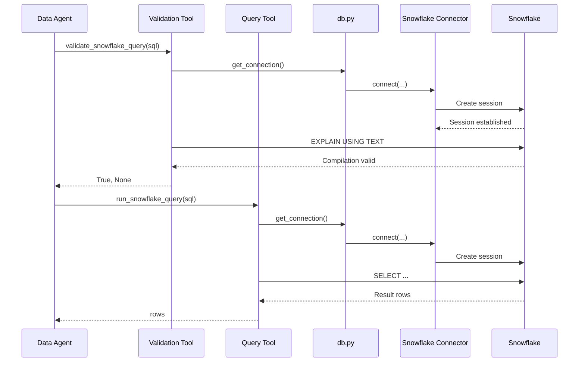

# Snowflake Tool Execution Flow

This document explains how the platform performs real Snowflake actions after an agent has decided what data is required.

The key architectural distinction is:

> Agents reason. Tools execute.

The Snowflake tool is the execution boundary between AI reasoning and the governed data platform.

---

# 1. Why a Tool Exists

The LLM does not connect to Snowflake directly.

The LLM may propose an action such as:

```text
Run this analytical query.
```

But the actual database operation is performed by application code.

The tool is therefore responsible for:

```text
opening the connection
executing Snowflake SQL
fetching results
handling errors
closing resources
returning data
```

---

# 2. Position in the Runtime Flow

```text
User Question
    ↓
Supervisor
    ↓
Data Agent
    ↓
Generated SQL
    ↓
SQL Guard
    ↓
Snowflake Validation Tool
    ↓
Snowflake Query Tool
    ↓
Snowflake
    ↓
Rows
    ↓
Data Agent
    ↓
AgentState
```

The tool sits after reasoning and validation.

---

# 3. Agent vs Tool

This distinction is fundamental.

## Agent

An agent answers questions such as:

```text
What should I do?

What query should answer this question?

Which capability should I use?
```

## Tool

A tool answers:

```text
Perform the requested action.
```

For this platform:

```text
Data Agent
    decides SQL

Snowflake Tool
    executes SQL
```

---

# 4. Python Tool Function

The current execution tool is conceptually:

```python
from db import get_connection


def run_snowflake_query(sql: str):
    conn = get_connection()
    cursor = conn.cursor()

    try:
        cursor.execute(sql)
        return cursor.fetchall()

    finally:
        cursor.close()
        conn.close()
```

This function contains no LLM reasoning.

It is deterministic execution code.

---

# 5. Tool Input

The tool receives SQL that has already passed upstream controls.

Example:

```sql
SELECT
    TICKET_CHANNEL,
    AVG(RESOLUTION_TIME_HOURS) AS AVG_RESOLUTION_TIME
FROM AI_ENGINEERING_LAB.CURATED.CUSTOMER_SUPPORT_TICKETS
GROUP BY TICKET_CHANNEL
ORDER BY AVG_RESOLUTION_TIME DESC;
```

The tool does not decide whether this query answers the user's question.

That decision belongs to the Data Agent.

---

# 6. Tool Output

The tool returns Snowflake rows.

Example:

```python
[
    ("Web Form", Decimal("39.345061")),
    ("Email", Decimal("39.257512")),
    ("Chat", Decimal("39.089198"))
]
```

These rows are returned to the Data Agent.

The Data Agent then returns them to LangGraph through:

```python
{
    "sql_result": result
}
```

---

# 7. Database Connection Layer

Connection logic is isolated in:

```text
python/db.py
```

A conceptual implementation is:

```python
import os
import snowflake.connector


def get_connection():
    return snowflake.connector.connect(
        user=os.environ["SNOWFLAKE_USER"],
        password=os.environ["SNOWFLAKE_PASSWORD"],
        account=os.environ["SNOWFLAKE_ACCOUNT"],
        warehouse=os.environ.get(
            "SNOWFLAKE_WAREHOUSE",
            "COMPUTE_WH"
        ),
        database=os.environ.get(
            "SNOWFLAKE_DATABASE",
            "AI_ENGINEERING_LAB"
        ),
        role=os.environ.get(
            "SNOWFLAKE_ROLE",
            "ACCOUNTADMIN"
        ),
    )
```

The connection layer is deliberately separated from agent logic.

---

# 8. Why Separate Connection Logic

Without separation, every agent or tool might repeat:

```text
credentials
account
warehouse
database
connection creation
```

Centralizing connection creation improves:

- reuse
- maintainability
- testing
- configuration management
- future authentication changes

---

# 9. Connection Flow

```text
Snowflake Tool
    ↓
get_connection()
    ↓
Environment Variables
    ↓
Snowflake Connector
    ↓
Snowflake Session
```

The tool receives a live Snowflake connection object.

---

# 10. Snowflake Connector

The platform uses the Snowflake Python connector.

Conceptually:

```text
Python Application
    ↓
snowflake.connector
    ↓
Snowflake Service
```

The connector handles:

- authentication
- network communication
- session creation
- SQL submission
- result retrieval

---

# 11. Cursor

After creating a connection:

```python
cursor = conn.cursor()
```

the application creates a cursor.

A cursor is the object used to send SQL statements through the connection.

Conceptually:

```text
Connection
    = Snowflake session

Cursor
    = SQL execution interface inside that session
```

---

# 12. Query Execution

The actual database operation happens here:

```python
cursor.execute(sql)
```

This is the point where SQL leaves the Python application and is submitted to Snowflake.

This is an important runtime boundary.

The LLM is not executing this line.

The Python runtime is.

---

# 13. Who Actually Executes SQL?

The complete chain is:

```text
LLM
    proposes SQL
        ↓
Data Agent Python Function
    calls tool
        ↓
Snowflake Tool Python Function
    calls cursor.execute()
        ↓
Snowflake Connector
    sends SQL
        ↓
Snowflake
    executes query
```

The actual computation occurs inside Snowflake.

---

# 14. Query Result Retrieval

After Snowflake finishes execution:

```python
rows = cursor.fetchall()
```

retrieves the returned rows.

Conceptually:

```text
Snowflake Result Set
    ↓
Snowflake Connector
    ↓
Python Cursor
    ↓
fetchall()
    ↓
Python List of Rows
```

---

# 15. Why Return Structured Rows

The tool returns structured data rather than immediately converting it to natural language.

Example:

```python
[
    ("Web Form", 39.345061),
    ("Email", 39.257512),
    ("Chat", 39.089198)
]
```

This keeps facts separate from interpretation.

The Insight Agent later converts those facts into language.

---

# 16. Resource Cleanup

Database resources must be closed even when an error occurs.

The current pattern uses:

```python
try:
    ...
finally:
    cursor.close()
    conn.close()
```

This ensures cleanup happens whether execution succeeds or fails.

---

# 17. Why Cleanup Matters

Without proper cleanup, long-running applications may accumulate:

```text
unused sessions
open connections
open cursors
resource leaks
```

Production services should manage connection lifecycle explicitly.

---

# 18. Snowflake Validation Tool

The platform also contains a separate validation function.

Example:

```python
def validate_snowflake_query(sql: str):
    conn = get_connection()
    cursor = conn.cursor()

    try:
        cursor.execute(
            f"EXPLAIN USING TEXT {sql}"
        )
        return True, None

    except Exception as e:
        return False, str(e)

    finally:
        cursor.close()
        conn.close()
```

This tool does not execute the analytical query itself.

It asks Snowflake to compile and validate it.

---

# 19. Validation Tool vs Execution Tool

The platform currently exposes two Snowflake capabilities.

## Validation

```text
validate_snowflake_query()
```

Purpose:

```text
Does this SQL compile?
```

## Execution

```text
run_snowflake_query()
```

Purpose:

```text
Execute this approved SQL and return results.
```

This separation makes the safety flow explicit.

---

# 20. EXPLAIN Execution

The validation tool sends:

```sql
EXPLAIN USING TEXT <generated SQL>
```

to Snowflake.

Snowflake validates:

- SQL syntax
- table references
- column references
- identifier resolution
- joins
- compilation semantics

---

# 21. Example Validation Failure

Suppose the generated SQL contains:

```sql
SELECT TICKET_CHANNEL
FROM TABLE_A
JOIN TABLE_B
...
```

and both tables expose:

```text
TICKET_CHANNEL
```

Snowflake may return:

```text
SQL compilation error:
ambiguous column name 'TICKET_CHANNEL'
```

The validation tool returns:

```python
(
    False,
    "SQL compilation error: ambiguous column name..."
)
```

The Data Agent can then use this error for repair.

---

# 22. Validation Success

If the SQL compiles:

```python
return True, None
```

The Data Agent then allows the actual execution tool to run.

---

# 23. Tool Execution Sequence



---

# 24. Tool Is Not an Agent

A tool does not independently decide:

```text
whether it should execute
what question the user asked
which table should be queried
how the answer should be interpreted
```

The tool performs a narrow capability.

This makes it easier to secure and test.

---

# 25. Tool Is Not the Runtime

The tool also does not decide which graph node runs next.

That responsibility belongs to LangGraph.

```text
LangGraph Runtime
    → controls workflow

Agent
    → reasons

Tool
    → executes external action
```

---

# 26. Current Tool Invocation Pattern

The current Data Agent directly invokes the Python function.

Conceptually:

```python
result = run_snowflake_query(sql)
```

The runtime sequence is:

```text
LangGraph
    ↓
Data Agent Node
    ↓
Python function call
    ↓
Snowflake Tool
```

---

# 27. Dedicated ToolNode Architecture

LangGraph also supports a different architecture where tools are executed through a dedicated Tool Node.

Conceptually:

```text
Agent Node
    ↓
Tool Call Request
    ↓
ToolNode
    ↓
Registered Tool
    ↓
External System
```

This architecture is useful when an LLM dynamically selects among multiple tools.

---

# 28. Tool vs ToolNode

This distinction is important.

## Tool

Actual executable capability.

Example:

```python
run_snowflake_query(sql)
```

## ToolNode

Graph component that receives tool requests and invokes the corresponding registered tool.

Conceptually:

```text
ToolNode
    = tool execution dispatcher
```

---

# 29. Current Architecture

The current implementation is:

```text
Data Agent Node
    ↓
run_snowflake_query()
    ↓
Snowflake
```

This keeps the implementation easy to understand and explicit.

---

# 30. Future Architecture

A more agentic implementation may become:

```text
Data Agent Node
    ↓
LLM emits tool call:
run_snowflake_query(...)
    ↓
Conditional Edge
    ↓
ToolNode
    ↓
Snowflake Tool
    ↓
Snowflake
    ↓
Tool Result
    ↓
Data Agent / Insight Agent
```

This separates reasoning from tool dispatch even more clearly.

---

# 31. Why Use ToolNode Later

A dedicated ToolNode becomes useful when the platform has multiple tools.

For example:

```text
query_snowflake
get_schema_metadata
search_policy_documents
calculate_metric
create_report
send_notification
```

The LLM may choose which tool it needs.

The ToolNode can execute the requested capability.

---

# 32. Tool Selection vs Tool Execution

In a mature agent:

```text
LLM
    selects tool

LangGraph
    routes tool request

ToolNode
    executes selected tool

Tool
    performs external operation
```

These are four separate responsibilities.

---

# 33. Tool Result and State

A tool result ultimately needs to return into graph state.

Current implementation:

```text
Snowflake Tool
    ↓
Data Agent receives rows
    ↓
Data Agent returns:
{"sql_result": rows}
    ↓
LangGraph merges state
```

Future ToolNode implementations may place tool results into message/state fields directly.

---

# 34. Why Tools Should Be Narrow

Tools should expose the minimum capability required.

For example, a safer tool is:

```text
run_read_only_analytics_query
```

rather than:

```text
execute_any_database_command
```

Narrow tools reduce the agent's operational blast radius.

---

# 35. Snowflake Role Boundary

Tool security should not depend only on Python validation.

The Snowflake identity used by the application should also be constrained.

A production design should use a dedicated role such as:

```text
AI_ANALYTICS_READER
```

with access only to required schemas and tables.

---

# 36. Defense in Depth

A stronger architecture uses multiple layers:

```text
LLM Prompt Constraints
        ↓
SQL Policy Guard
        ↓
Snowflake Read-Only Role
        ↓
Table / View Grants
        ↓
Masking / Row Access Policies
```

If one layer fails, another layer still protects the data platform.

---

# 37. Snowflake Warehouse

Queries execute using a Snowflake virtual warehouse.

Current reference warehouse:

```text
COMPUTE_WH
```

Conceptually:

```text
Tool
    ↓
Snowflake Session
    ↓
Virtual Warehouse
    ↓
Query Execution
```

The warehouse provides compute.

Snowflake storage remains separate.

---

# 38. Why Warehouse Selection Matters

A production system could isolate AI queries into a dedicated warehouse.

Example:

```text
ETL_WH
BI_WH
AI_AGENT_WH
```

Benefits include:

- workload isolation
- independent scaling
- cost attribution
- resource governance

---

# 39. Query Timeout

A production tool should enforce execution limits.

Example future control:

```text
statement timeout
```

This protects the platform from unexpectedly expensive LLM-generated queries.

---

# 40. Result Limits

The agent generally should not retrieve millions of rows into Python.

Future controls could enforce:

```text
LIMIT
maximum row count
maximum result size
aggregation-first rules
```

Analytical computations should remain inside Snowflake whenever possible.

---

# 41. Why Compute in Snowflake

This is preferable:

```sql
SELECT
    TICKET_CHANNEL,
    AVG(RESOLUTION_TIME_HOURS)
FROM ...
GROUP BY TICKET_CHANNEL;
```

to:

```text
retrieve 20,000 rows into Python
↓
calculate average locally
```

Snowflake is designed for set-based analytical processing.

---

# 42. Connection Pooling

The current implementation creates connections per tool invocation.

For a production API, a stronger implementation could use:

- connection pooling
- managed connection lifecycle
- retry policies
- session reuse where appropriate

The exact strategy depends on application concurrency and Snowflake connection behavior.

---

# 43. Error Handling

Tool errors should be returned as structured failures rather than uncontrolled tracebacks.

Example future output:

```python
{
    "success": False,
    "error_type": "SQL_COMPILATION_ERROR",
    "message": "...",
}
```

This makes downstream agent handling more predictable.

---

# 44. Structured Tool Result

A stronger tool contract could return:

```python
{
    "success": True,
    "columns": [
        "TICKET_CHANNEL",
        "AVG_RESOLUTION_TIME"
    ],
    "rows": [
        ["Web Form", 39.34],
        ["Email", 39.25],
        ["Chat", 39.08]
    ],
    "row_count": 3,
    "execution_ms": 421
}
```

This provides more context to the workflow.

---

# 45. Observability

The Snowflake tool is a useful observability boundary.

Future telemetry could capture:

```text
query_id
generated SQL
execution duration
warehouse
row count
bytes scanned
error type
retry count
caller agent
```

Snowflake query history can also support deeper investigation.

---

# 46. Snowflake Query ID

Snowflake assigns a query ID to executed statements.

A future implementation can record that identifier and correlate:

```text
Agent Request
    ↓
Generated SQL
    ↓
Snowflake Query ID
    ↓
Query History
```

This creates strong traceability.

---

# 47. Query Tags

A future architecture could set Snowflake query tags such as:

```text
agent=data_agent
request_id=...
workflow=agentic_analytics
```

This would improve:

- cost attribution
- auditability
- operational troubleshooting

---

# 48. Tool Testing

Tools are easier to unit/integration test because they have narrow responsibilities.

Example:

```python
result = run_snowflake_query(
    "SELECT 1"
)
```

can verify database connectivity independently of the LLM.

Likewise:

```python
validate_snowflake_query(
    "SELECT ..."
)
```

can be tested separately from agent routing.

---

# 49. Agent Testing vs Tool Testing

These are different tests.

## Agent Test

```text
Did the agent choose/generate the correct SQL?
```

## Tool Test

```text
Did the tool execute the SQL correctly?
```

Separating these responsibilities simplifies debugging.

---

# 50. Failure Isolation

Suppose the final answer is wrong.

The architecture allows investigation at each layer:

```text
Was routing wrong?
        ↓
Was generated SQL wrong?
        ↓
Did SQL validation fail?
        ↓
Did Snowflake return wrong/unexpected data?
        ↓
Did Insight Agent interpret correctly?
```

The tool boundary makes database execution independently observable.

---

# 51. Complete Tool Mental Model

```text
Data Agent
    ↓
"I need this data."

Snowflake Validation Tool
    ↓
"Does this query compile?"

Snowflake
    ↓
"Yes."

Data Agent
    ↓
"Execute it."

Snowflake Query Tool
    ↓
Open connection
    ↓
Create cursor
    ↓
Execute SELECT
    ↓
Fetch rows
    ↓
Close resources
    ↓
Return rows

Data Agent
    ↓
Store result in AgentState
```

---

# 52. Responsibility Matrix

| Component | Responsibility |
|---|---|
| LLM | Propose action / SQL |
| Data Agent | Coordinate query generation and execution |
| SQL Guard | Enforce policy |
| Validation Tool | Ask Snowflake to compile query |
| Query Tool | Execute approved query |
| `db.py` | Create Snowflake connection |
| Snowflake Connector | Network/session communication |
| Cursor | Submit SQL |
| Snowflake Warehouse | Execute compute |
| Snowflake Storage | Provide governed data |
| LangGraph | Control workflow |
| AgentState | Carry results |

---

# 53. Architectural Principle

> A tool is the controlled execution boundary between agent reasoning and the outside world.

For this platform, Snowflake remains the governed execution environment, while the tool provides the narrow interface through which agents interact with it.
````