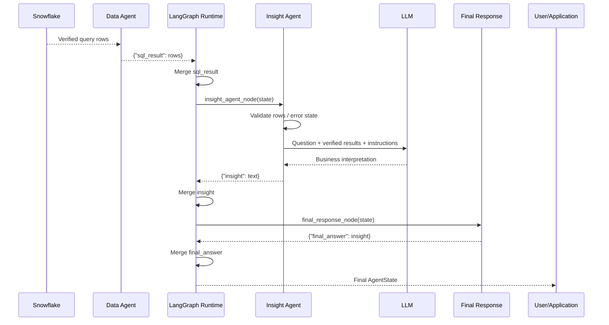

                                                                                                                               # Insight and Final Response Flow

This document explains how verified Snowflake query results are converted into user-facing business interpretation.

The Insight layer is intentionally separated from the Data Agent so that:

- Snowflake produces facts
- Python preserves exact values
- the LLM interprets those facts
- the final response node exposes the user-facing answer

The design principle is:

> Deterministic systems calculate facts. LLMs interpret facts.

---

# 1. Position in the Graph

The relevant section of the graph is:

```text
Data Agent
    ↓
Snowflake Query Result
    ↓
Insight Agent
    ↓
Final Response Node
    ↓
END
```

The Insight Agent executes only after the Data Agent has returned verified analytical data.

---

# 2. Input to the Insight Agent

The Insight Agent receives the current `AgentState`.

Example:

```python
{
    "user_question": "Which support channels have the worst average resolution time?",
    "route": "data_agent",
    "sql_result": [
        ("Web Form", 39.345061),
        ("Email", 39.257512),
        ("Chat", 39.089198)
    ],
    "insight": None,
    "final_answer": None
}
```

The main fields used are:

```python
state["user_question"]
state["sql_result"]
```

---

# 3. Why the Insight Agent Exists

The Data Agent answers:

> What data is required?

The Insight Agent answers:

> What does this data mean for the business?

These are different responsibilities.

Example:

```text
Snowflake Result

Web Form    39.345061
Email       39.257512
Chat        39.089198
```

The Insight Agent converts that into:

```text
Web Form has the highest average resolution time.

Operational investigation should prioritize the Web Form channel.
```

---

# 4. Facts Before Interpretation

The Insight Agent should not invent or recalculate critical facts when deterministic systems can provide them.

Preferred flow:

```text
Snowflake / Python
    ↓
Verified values
    ↓
Insight Agent
    ↓
Interpretation
```

Avoid:

```text
Raw data
    ↓
LLM performs arithmetic
    ↓
LLM may miscalculate
```

---

# 5. Why This Matters

During development, an LLM incorrectly interpreted:

```text
LOW_RISK       12,447
MEDIUM_RISK     5,795
HIGH_RISK       1,758
```

and produced an incorrect total.

That demonstrated an important design principle:

```text
LLM
    should not be responsible for exact arithmetic
    when Python or SQL can compute it deterministically
```

---

# 6. Deterministic Fact Preparation

For risk analysis, Python can calculate:

```python
total = sum(count for _, count in rows)
```

and percentages:

```python
percentage = round(
    (count / total) * 100,
    2
)
```

The LLM then receives verified facts.

Example:

```text
LOW_RISK: 12,447 tickets (62.23%)
MEDIUM_RISK: 5,795 tickets (28.98%)
HIGH_RISK: 1,758 tickets (8.79%)
```

The LLM's responsibility becomes interpretation rather than calculation.

---

# 7. Generic Insight Agent

A generic implementation looks like:

```python
from agent_state import AgentState
from llm_client import call_llm


def insight_agent_node(state: AgentState):
    rows = state["sql_result"]

    if not rows:
        return {
            "insight": "No data was returned for this question."
        }

    if rows[0][0] == "ERROR":
        return {
            "insight": f"Data retrieval failed: {rows[0][1]}"
        }

    prompt = f"""
You are a support operations analyst.

User question:
{state["user_question"]}

These are verified query results returned from Snowflake:

{rows}

Rules:
- Do not invent numbers.
- Base the answer only on the provided results.
- Explain the most important pattern.
- Give one practical operational recommendation.
- Keep the response concise.
"""

    insight = call_llm(prompt)

    return {
        "insight": insight
    }
```

---

# 8. Why the Insight Agent Uses the Original Question

The same result set can mean different things depending on the user's intent.

The Insight Agent therefore receives both:

```text
user question
+
query result
```

Example:

```text
Question:
Which channels have the worst average resolution time?

Result:
Web Form    39.34
Email       39.25
Chat        39.08
```

The user intent tells the model to focus on ranking the slowest channel.

---

# 9. Unit Preservation

The LLM must also understand the meaning of metrics.

For example:

```text
RESOLUTION_TIME_HOURS
```

means the values are measured in:

```text
hours
```

Without that metadata, the model may incorrectly describe them as days.

A stronger architecture should attach metric metadata explicitly.

---

# 10. Recommended Metric Metadata

Future state could include:

```python
{
    "metric_metadata": {
        "AVG_RESOLUTION_TIME": {
            "unit": "hours",
            "description": "Average ticket resolution time"
        }
    }
}
```

This gives the Insight Agent semantic information about the result.

---

# 11. Structured Query Result

A stronger tool contract could return:

```python
{
    "columns": [
        "TICKET_CHANNEL",
        "AVG_RESOLUTION_TIME"
    ],
    "rows": [
        ["Web Form", 39.345061],
        ["Email", 39.257512],
        ["Chat", 39.089198]
    ],
    "units": {
        "AVG_RESOLUTION_TIME": "hours"
    }
}
```

This is more reliable than passing anonymous tuples.

---

# 12. Insight Agent Flow

```text
AgentState
    ↓
Read user_question
    ↓
Read sql_result
    ↓
Validate result exists
    ↓
Check for execution errors
    ↓
Prepare verified context
    ↓
Call LLM
    ↓
Generate interpretation
    ↓
Return {"insight": "..."}
```

---

# 13. Error Path

If the Data Agent returns:

```python
[
    (
        "ERROR",
        "Generated SQL failed safety validation"
    )
]
```

the Insight Agent should not try to interpret it as business data.

Instead:

```text
Detect ERROR
    ↓
Return safe explanation
```

Example:

```python
{
    "insight":
        "Data retrieval failed: Generated SQL failed safety validation"
}
```

---

# 14. Why Error Detection Is Deterministic

The Insight Agent should not ask the LLM whether the result represents an error.

Application code already knows.

Preferred:

```python
if rows[0][0] == "ERROR":
    ...
```

rather than:

```text
LLM:
"Does this look like an error?"
```

Again:

```text
deterministic logic
    handles known control conditions

LLM
    handles semantic interpretation
```

---

# 15. LLM Prompt Boundary

The prompt should clearly state:

```text
These are verified query results.
Do not invent numbers.
Do not change values.
Base the response only on supplied data.
```

This establishes grounding.

---

# 16. Example Insight

For:

```text
Web Form    39.345061 hours
Email       39.257512 hours
Chat        39.089198 hours
```

the model can produce:

```text
Web Form has the highest average resolution time,
although all three channels are relatively close.

Operational improvement should first investigate the Web Form
workflow before moving to Email and Chat.
```

---

# 17. Insight vs Recommendation

The output can contain two conceptual parts.

## Insight

What does the data indicate?

Example:

```text
Web Form currently has the highest average resolution time.
```

## Recommendation

What action should a business user consider?

Example:

```text
Review Web Form triage and routing processes to identify avoidable delays.
```

The recommendation remains advisory.

---

# 18. Why Recommendations Are Not Automatically Executed

The Insight Agent does not automatically take operational action.

It generates decision support.

This prevents:

```text
LLM recommendation
    ↓
automatic business action
```

without an explicit approval or action workflow.

Future action agents should have separate governance.

---

# 19. Insight Agent as a LangGraph Node

The Insight Agent is registered as:

```python
builder.add_node(
    "insight_agent",
    insight_agent_node
)
```

A normal edge connects it from the Data Agent:

```python
builder.add_edge(
    "data_agent",
    "insight_agent"
)
```

This means there is no additional routing decision in the current graph.

---

# 20. State Before Insight Agent

```python
{
    "user_question": "...",
    "route": "data_agent",
    "sql_result": [...],
    "insight": None,
    "final_answer": None
}
```

---

# 21. Insight Agent Return

```python
{
    "insight": "Web Form currently has the highest average resolution time..."
}
```

---

# 22. LangGraph State Merge

LangGraph merges that partial update.

The new state becomes:

```python
{
    "user_question": "...",
    "route": "data_agent",
    "sql_result": [...],
    "insight": "Web Form currently has the highest average resolution time...",
    "final_answer": None
}
```

---

# 23. Final Response Node

After the Insight Agent, the graph executes the Final Response Node.

Example:

```python
from agent_state import AgentState


def final_response_node(state: AgentState):
    return {
        "final_answer": state["insight"]
    }
```

The current implementation simply promotes the internal insight into the final user-facing response.

---

# 24. Why Have a Separate Final Node

It may appear redundant because:

```text
final_answer = insight
```

today.

However, the separation creates a clean future boundary.

The Final Response Node can later handle:

- formatting
- citations
- response templates
- user-specific tone
- confidence indicators
- source references
- redaction
- policy enforcement
- multiple-agent synthesis

---

# 25. Future Final Response Example

A future node might produce:

```text
Summary:
Web Form has the highest average resolution time.

Evidence:
Web Form: 39.35 hours
Email: 39.26 hours
Chat: 39.09 hours

Recommendation:
Investigate Web Form routing and staffing.

Source:
Snowflake ANALYTICS / CURATED data
```

The Insight Agent could remain focused only on reasoning.

---

# 26. Final Response State Update

The Final Response Node returns:

```python
{
    "final_answer": state["insight"]
}
```

LangGraph merges this into the state.

---

# 27. Final State

The graph eventually contains:

```python
{
    "user_question":
        "Which support channels have the worst average resolution time?",

    "route":
        "data_agent",

    "sql_result": [
        ("Web Form", 39.345061),
        ("Email", 39.257512),
        ("Chat", 39.089198)
    ],

    "insight":
        "Web Form currently has the highest average resolution time...",

    "final_answer":
        "Web Form currently has the highest average resolution time..."
}
```

---

# 28. END

The graph contains:

```python
builder.add_edge(
    "final_response",
    END
)
```

After the final node returns:

```text
LangGraph merges final_answer
    ↓
END reached
    ↓
graph execution stops
```

---

# 29. graph.invoke() Return Value

The application originally called:

```python
result = graph.invoke(initial_state)
```

Once `END` is reached:

```python
result
```

contains the final merged `AgentState`.

---

# 30. Complete Response Flow

```text
Snowflake
    ↓
verified rows

Data Agent
    ↓
sql_result

LangGraph
    ↓
merge state

Insight Agent
    ↓
semantic interpretation

LangGraph
    ↓
merge insight

Final Response Node
    ↓
final_answer

LangGraph
    ↓
END

Application
    ↓
User
```

---

# 31. Sequence Diagram



---

# 32. Deterministic vs Probabilistic Boundary

The architecture can be summarized as:

```text
Snowflake
    ↓
Exact facts

Python
    ↓
Known validation / calculations

LLM
    ↓
Interpretation

Python
    ↓
Final response handling
```

This is a deliberate design decision.

---

# 33. What the LLM Should Do

The Insight Agent is appropriate for:

```text
pattern interpretation
qualitative comparison
summarization
business implications
recommendations
natural-language explanation
```

---

# 34. What the LLM Should Not Do

Prefer deterministic systems for:

```text
exact totals
percentages
threshold checks
sorting
filtering
currency calculations
date calculations
business-rule enforcement
```

unless there is no deterministic alternative.

---

# 35. Hallucination Reduction

Several controls reduce hallucination risk.

```text
Verified Snowflake results
        ↓
Explicit prompt grounding
        ↓
Correct metric units
        ↓
No unsupported external context
        ↓
LLM interpretation
```

The LLM is not expected to retrieve its own factual data.

---

# 36. Empty Result Handling

If Snowflake returns:

```python
[]
```

the node should return:

```text
No data was returned for this question.
```

rather than asking the LLM to invent an explanation.

---

# 37. Large Result Handling

The Insight Agent should not receive extremely large raw datasets.

Preferred:

```text
Snowflake
    ↓
aggregate / filter
    ↓
small verified result
    ↓
Insight Agent
```

This improves:

- latency
- token usage
- grounding
- clarity
- cost

---

# 38. Why Analytics Happens Before LLM

For example:

```sql
SELECT
    TICKET_CHANNEL,
    AVG(RESOLUTION_TIME_HOURS)
...
```

should run in Snowflake.

The LLM should not receive all 20,000 support tickets just to calculate three averages.

---

# 39. Result Schema Awareness

A production Insight Agent should know:

```text
column names
data types
units
metric definitions
```

Example:

```text
AVG_RESOLUTION_TIME
type = NUMBER
unit = hours
business meaning = average ticket resolution duration
```

This improves interpretation reliability.

---

# 40. Semantic Layer Opportunity

A future semantic layer could define business metrics such as:

```text
Average Resolution Time
Customer Satisfaction
SLA Risk
Ticket Volume
High Priority Rate
```

The Insight Agent would reason over named business metrics rather than raw columns.

---

# 41. Recommendation Confidence

A stronger system could distinguish:

```text
fact
interpretation
recommendation
```

Example:

```text
FACT:
Web Form average resolution time is 39.35 hours.

INTERPRETATION:
This is the highest among the three channels.

RECOMMENDATION:
Investigate Web Form routing and staffing.
```

This improves transparency.

---

# 42. Final Response Formatting

Future final-response logic could generate structured output:

```json
{
  "summary": "...",
  "evidence": [...],
  "recommendation": "...",
  "source": "Snowflake",
  "confidence": "high"
}
```

A UI could then render each field separately.

---

# 43. Citation to Data

Future responses could include analytical provenance.

Example:

```text
Source:
AI_ENGINEERING_LAB.CURATED.CUSTOMER_SUPPORT_TICKETS
```

or:

```text
Snowflake Query ID: ...
```

This would improve auditability.

---

# 44. Human Decision Boundary

Recommendations should remain distinct from actions.

```text
Insight Agent
    ↓
Recommendation
    ↓
Human / Approved Workflow
    ↓
Action
```

This is particularly important for enterprise systems.

---

# 45. Future Multi-Agent Synthesis

If the platform later introduces:

```text
Data Agent
Policy Agent
Risk Agent
Forecasting Agent
```

the Final Response Node could combine their outputs.

Example:

```text
Data Insight
+
Policy Context
+
Risk Assessment
    ↓
Final Response Node
    ↓
Unified Answer
```

---

# 46. Observability

Useful telemetry for the Insight Agent includes:

```text
model
prompt version
input row count
response latency
token usage
output length
evaluation score
hallucination score
user feedback
```

This allows systematic quality improvement.

---

# 47. Evaluation

The Insight Agent can be evaluated on:

```text
factual consistency
answer relevance
recommendation usefulness
numeric faithfulness
unit correctness
groundedness
```

Example automated check:

```text
Does the answer claim Web Form is the highest?

Actual Snowflake ranking:
Web Form > Email > Chat

Expected:
Yes
```

---

# 48. Separation of Internal and External State

The platform distinguishes:

```text
insight
    = internal reasoning result

final_answer
    = user-facing response
```

Even if they are currently identical, they represent different architectural responsibilities.

---

# 49. Complete Mental Model

```text
Snowflake Rows
    ↓
"These are facts."

Insight Agent
    ↓
"What do these facts mean?"

insight
    ↓
"Internal interpretation."

Final Response Node
    ↓
"How should this be presented?"

final_answer
    ↓
"User-facing response."
```

---

# 50. Responsibility Matrix

| Component | Responsibility |
|---|---|
| Snowflake | Produce verified analytical facts |
| Data Agent | Return query results into state |
| LangGraph | Propagate state |
| Insight Agent | Interpret facts |
| LLM | Generate semantic explanation |
| Final Response Node | Produce user-facing output |
| END | Stop graph execution |
| Application | Return final answer to consumer |

---

# 51. Architectural Principle

> The Insight Agent should explain verified data, not manufacture data.

This keeps semantic reasoning grounded in Snowflake while preserving a clean boundary between analytics and natural-language decision support.
````