# Sequence Diagrams

This document provides a visual reference for the major runtime, data, infrastructure, and agent interaction flows in the Snowflake Agentic Intelligence Platform.

These diagrams are intended to answer one question clearly:

> Which component calls which other component, in what order, and what information is passed between them?

---

# 1. Full End-to-End Agent Flow

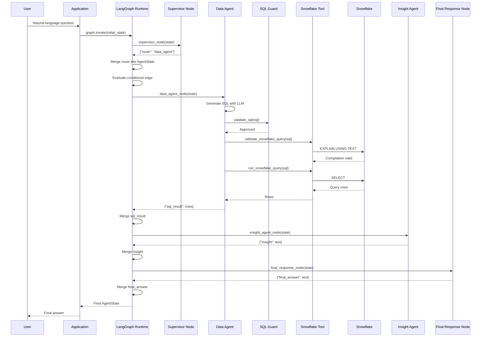
```mermaid
sequenceDiagram
    participant U as User
    participant APP as Application
    participant LG as LangGraph Runtime
    participant S as Supervisor Node
    participant D as Data Agent
    participant G as SQL Guard
    participant T as Snowflake Tool
    participant SF as Snowflake
    participant I as Insight Agent
    participant F as Final Response Node

    U->>APP: Natural-language question

    APP->>LG: graph.invoke(initial_state)

    LG->>S: supervisor_node(state)

    S-->>LG: {"route": "data_agent"}

    LG->>LG: Merge route into AgentState

    LG->>LG: Evaluate conditional edge

    LG->>D: data_agent_node(state)

    D->>D: Generate SQL with LLM

    D->>G: validate_sql(sql)

    G-->>D: Approved

    D->>T: validate_snowflake_query(sql)

    T->>SF: EXPLAIN USING TEXT

    SF-->>T: Compilation valid

    D->>T: run_snowflake_query(sql)

    T->>SF: SELECT

    SF-->>T: Query rows

    T-->>D: Rows

    D-->>LG: {"sql_result": rows}

    LG->>LG: Merge sql_result

    LG->>I: insight_agent_node(state)

    I-->>LG: {"insight": text}

    LG->>LG: Merge insight

    LG->>F: final_response_node(state)

    F-->>LG: {"final_answer": text}

    LG->>LG: Merge final_answer

    LG-->>APP: Final AgentState

    APP-->>U: Final answer
```

---

# 2. LangGraph State Evolution

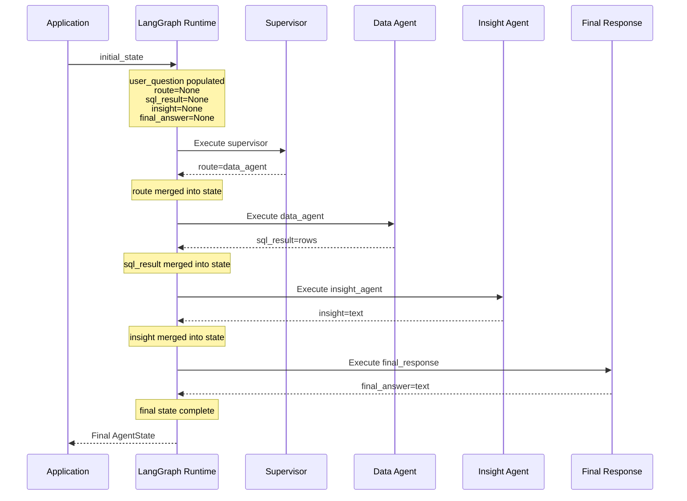
```mermaid
sequenceDiagram
    participant APP as Application
    participant LG as LangGraph Runtime
    participant S as Supervisor
    participant D as Data Agent
    participant I as Insight Agent
    participant F as Final Response

    APP->>LG: initial_state

    Note over LG: user_question populated<br/>route=None<br/>sql_result=None<br/>insight=None<br/>final_answer=None

    LG->>S: Execute supervisor

    S-->>LG: route=data_agent

    Note over LG: route merged into state

    LG->>D: Execute data_agent

    D-->>LG: sql_result=rows

    Note over LG: sql_result merged into state

    LG->>I: Execute insight_agent

    I-->>LG: insight=text

    Note over LG: insight merged into state

    LG->>F: Execute final_response

    F-->>LG: final_answer=text

    Note over LG: final state complete

    LG-->>APP: Final AgentState
```

---

# 3. Supervisor Routing Flow

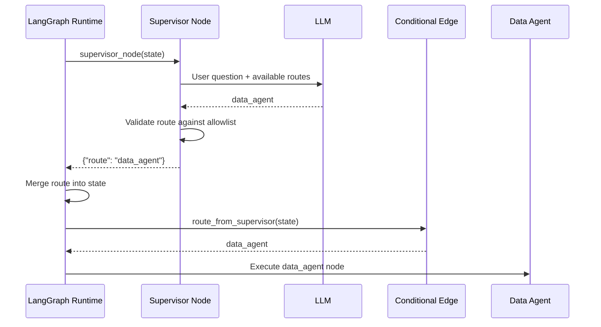
```mermaid
sequenceDiagram
    participant LG as LangGraph Runtime
    participant S as Supervisor Node
    participant L as LLM
    participant R as Conditional Edge
    participant D as Data Agent

    LG->>S: supervisor_node(state)

    S->>L: User question + available routes

    L-->>S: data_agent

    S->>S: Validate route against allowlist

    S-->>LG: {"route": "data_agent"}

    LG->>LG: Merge route into state

    LG->>R: route_from_supervisor(state)

    R-->>LG: data_agent

    LG->>D: Execute data_agent node
```

---

# 4. Text-to-SQL Generation Flow

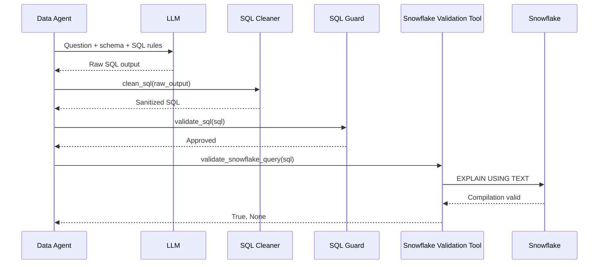
```mermaid
sequenceDiagram
    participant D as Data Agent
    participant L as LLM
    participant C as SQL Cleaner
    participant G as SQL Guard
    participant V as Snowflake Validation Tool
    participant SF as Snowflake

    D->>L: Question + schema + SQL rules

    L-->>D: Raw SQL output

    D->>C: clean_sql(raw_output)

    C-->>D: Sanitized SQL

    D->>G: validate_sql(sql)

    G-->>D: Approved

    D->>V: validate_snowflake_query(sql)

    V->>SF: EXPLAIN USING TEXT

    SF-->>V: Compilation valid

    V-->>D: True, None
```

---

# 5. SQL Repair Flow

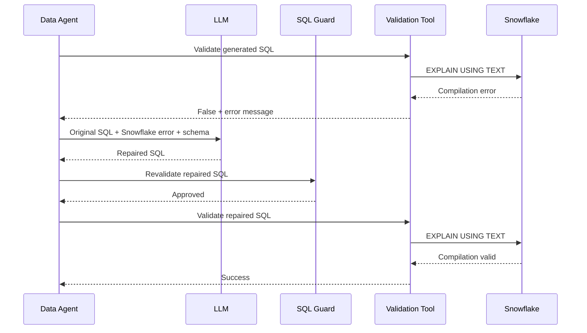
```mermaid
sequenceDiagram
    participant D as Data Agent
    participant L as LLM
    participant G as SQL Guard
    participant V as Validation Tool
    participant SF as Snowflake

    D->>V: Validate generated SQL

    V->>SF: EXPLAIN USING TEXT

    SF-->>V: Compilation error

    V-->>D: False + error message

    D->>L: Original SQL + Snowflake error + schema

    L-->>D: Repaired SQL

    D->>G: Revalidate repaired SQL

    G-->>D: Approved

    D->>V: Validate repaired SQL

    V->>SF: EXPLAIN USING TEXT

    SF-->>V: Compilation valid

    V-->>D: Success
```

---

# 6. Snowflake Tool Execution Flow

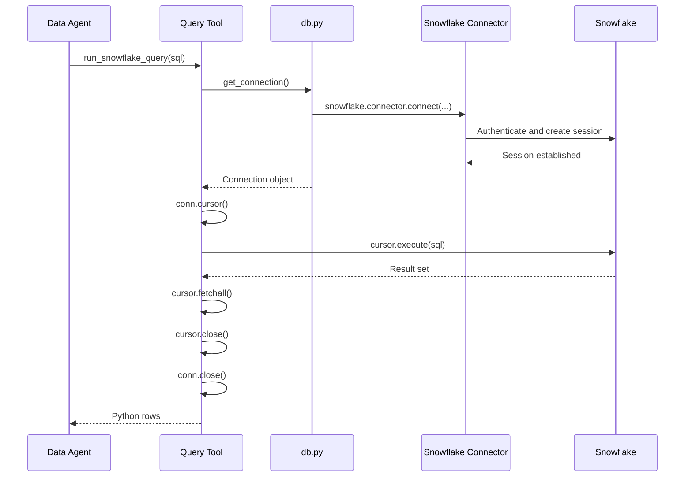
```mermaid
sequenceDiagram
    participant D as Data Agent
    participant T as Query Tool
    participant DB as db.py
    participant SC as Snowflake Connector
    participant SF as Snowflake

    D->>T: run_snowflake_query(sql)

    T->>DB: get_connection()

    DB->>SC: snowflake.connector.connect(...)

    SC->>SF: Authenticate and create session

    SF-->>SC: Session established

    DB-->>T: Connection object

    T->>T: conn.cursor()

    T->>SF: cursor.execute(sql)

    SF-->>T: Result set

    T->>T: cursor.fetchall()

    T->>T: cursor.close()

    T->>T: conn.close()

    T-->>D: Python rows
```

---

# 7. Agent vs Tool vs Runtime

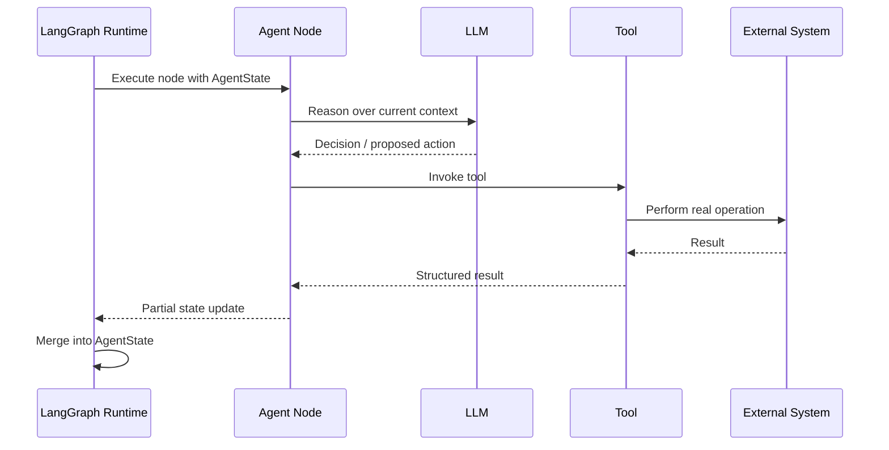
```mermaid
sequenceDiagram
    participant LG as LangGraph Runtime
    participant A as Agent Node
    participant L as LLM
    participant T as Tool
    participant SYS as External System

    LG->>A: Execute node with AgentState

    A->>L: Reason over current context

    L-->>A: Decision / proposed action

    A->>T: Invoke tool

    T->>SYS: Perform real operation

    SYS-->>T: Result

    T-->>A: Structured result

    A-->>LG: Partial state update

    LG->>LG: Merge into AgentState
```

The responsibilities are:

```text
LangGraph Runtime
    controls execution

Agent
    performs reasoning

LLM
    generates semantic decisions

Tool
    performs actual external action

External System
    executes governed operation
```

---

# 8. Current Architecture Without ToolNode

The current implementation directly calls Python tools from the Data Agent node.

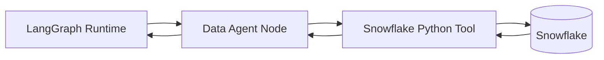
```mermaid
flowchart LR

    LG[LangGraph Runtime]
        --> D[Data Agent Node]

    D
        --> T[Snowflake Python Tool]

    T
        --> SF[(Snowflake)]

    SF
        --> T

    T
        --> D

    D
        --> LG
```

Current runtime:

```text
LangGraph
→ Data Agent Node
→ Python Tool Function
→ Snowflake
```

---

# 9. Future ToolNode Architecture

A future implementation can introduce a dedicated LangGraph `ToolNode`.

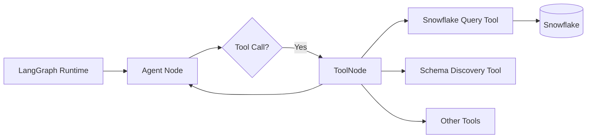
```mermaid
flowchart LR

    LG[LangGraph Runtime]
        --> A[Agent Node]

    A
        --> TC{Tool Call?}

    TC
        -->|Yes| TN[ToolNode]

    TN
        --> T1[Snowflake Query Tool]

    TN
        --> T2[Schema Discovery Tool]

    TN
        --> T3[Other Tools]

    T1
        --> SF[(Snowflake)]

    TN
        --> A
```

The flow becomes:

```text
Agent
    ↓
LLM selects tool
    ↓
Tool call message
    ↓
LangGraph ToolNode
    ↓
Registered Python tool
    ↓
External system
```

---

# 10. ToolNode Communication Model

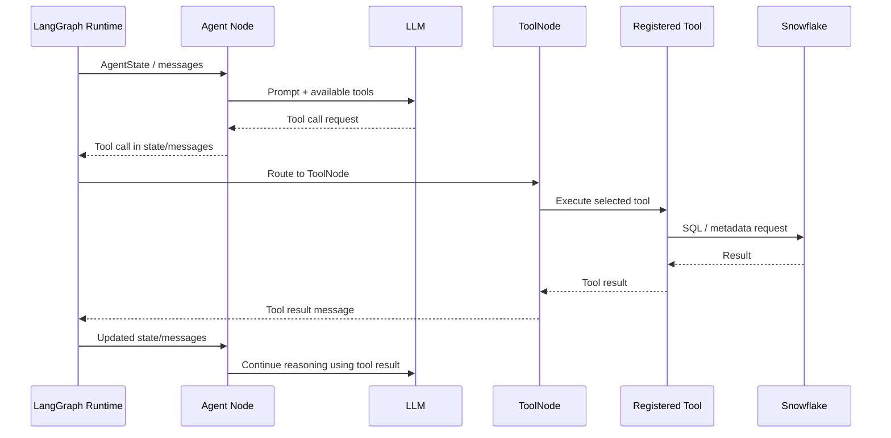
```mermaid
sequenceDiagram
    participant LG as LangGraph Runtime
    participant A as Agent Node
    participant L as LLM
    participant TN as ToolNode
    participant T as Registered Tool
    participant SF as Snowflake

    LG->>A: AgentState / messages

    A->>L: Prompt + available tools

    L-->>A: Tool call request

    A-->>LG: Tool call in state/messages

    LG->>TN: Route to ToolNode

    TN->>T: Execute selected tool

    T->>SF: SQL / metadata request

    SF-->>T: Result

    T-->>TN: Tool result

    TN-->>LG: Tool result message

    LG->>A: Updated state/messages

    A->>L: Continue reasoning using tool result
```

This is the more typical agent-tool loop when native tool calling is introduced.

---

# 11. Data Ingestion Flow

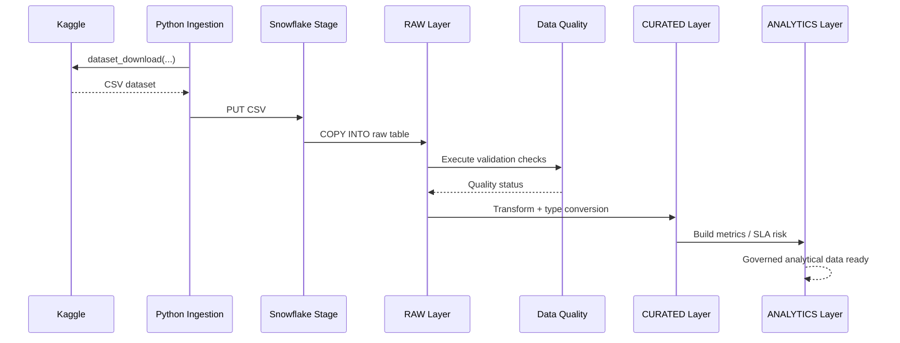
```mermaid
sequenceDiagram
    participant K as Kaggle
    participant P as Python Ingestion
    participant ST as Snowflake Stage
    participant RAW as RAW Layer
    participant DQ as Data Quality
    participant CUR as CURATED Layer
    participant AN as ANALYTICS Layer

    P->>K: dataset_download(...)

    K-->>P: CSV dataset

    P->>ST: PUT CSV

    ST->>RAW: COPY INTO raw table

    RAW->>DQ: Execute validation checks

    DQ-->>RAW: Quality status

    RAW->>CUR: Transform + type conversion

    CUR->>AN: Build metrics / SLA risk

    AN-->>AN: Governed analytical data ready
```

---

# 12. Snowflake Data Layer Flow

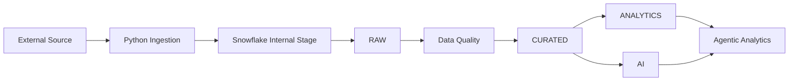
```mermaid
flowchart LR

    SRC[External Source]
        --> ING[Python Ingestion]

    ING
        --> ST[Snowflake Internal Stage]

    ST
        --> RAW[RAW]

    RAW
        --> DQ[Data Quality]

    DQ
        --> CUR[CURATED]

    CUR
        --> AN[ANALYTICS]

    CUR
        --> AI[AI]

    AN
        --> AGENT[Agentic Analytics]

    AI
        --> AGENT
```

---

# 13. Data and Agent Platform Integration

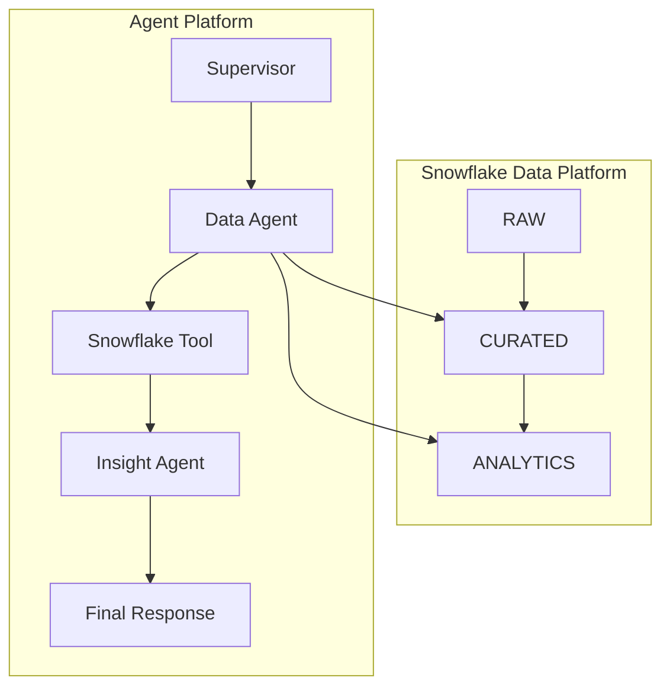
```mermaid
flowchart TD

    subgraph DataPlatform[Snowflake Data Platform]

        RAW[RAW]
        CUR[CURATED]
        AN[ANALYTICS]

        RAW --> CUR
        CUR --> AN
    end

    subgraph AgentPlatform[Agent Platform]

        SUP[Supervisor]
        DA[Data Agent]
        TOOL[Snowflake Tool]
        IA[Insight Agent]
        FR[Final Response]

        SUP --> DA
        DA --> TOOL
        TOOL --> IA
        IA --> FR
    end

    DA --> CUR
    DA --> AN
```

The important boundary is:

```text
AI Agent
    does not own enterprise data

Snowflake
    owns governed enterprise data
```

---

# 14. CI Validation Flow

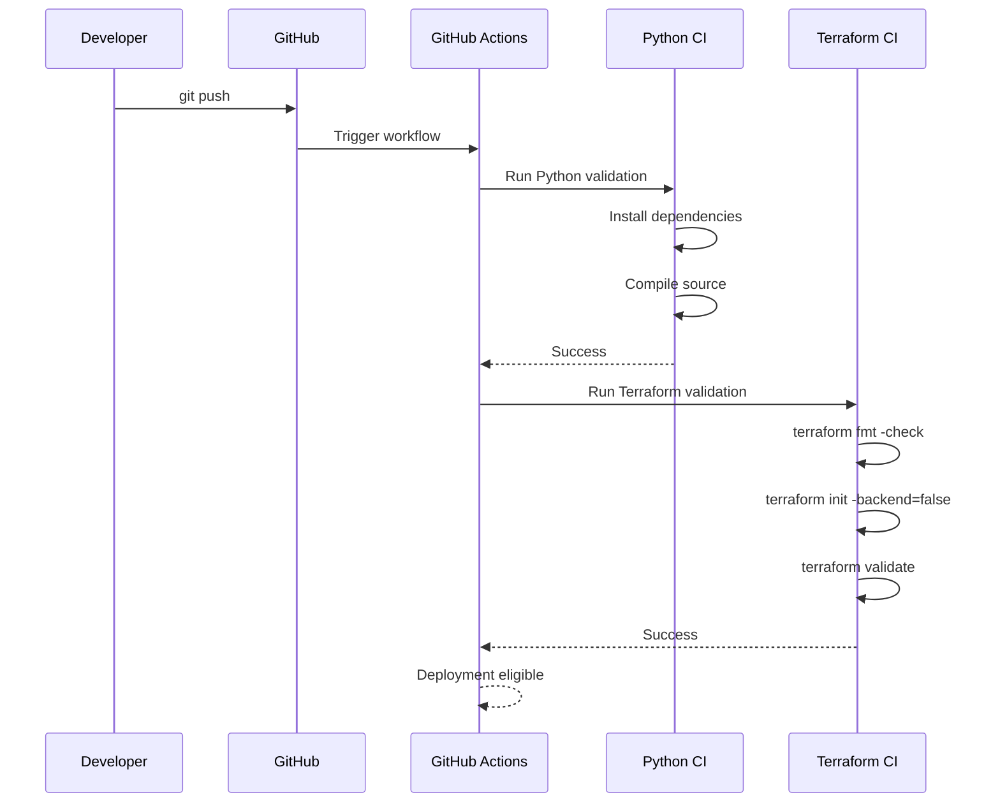
```mermaid
sequenceDiagram
    participant DEV as Developer
    participant GH as GitHub
    participant CI as GitHub Actions
    participant PY as Python CI
    participant TF as Terraform CI

    DEV->>GH: git push

    GH->>CI: Trigger workflow

    CI->>PY: Run Python validation

    PY->>PY: Install dependencies
    PY->>PY: Compile source

    PY-->>CI: Success

    CI->>TF: Run Terraform validation

    TF->>TF: terraform fmt -check
    TF->>TF: terraform init -backend=false
    TF->>TF: terraform validate

    TF-->>CI: Success

    CI-->>CI: Deployment eligible
```

---

# 15. GitHub OIDC Authentication Flow

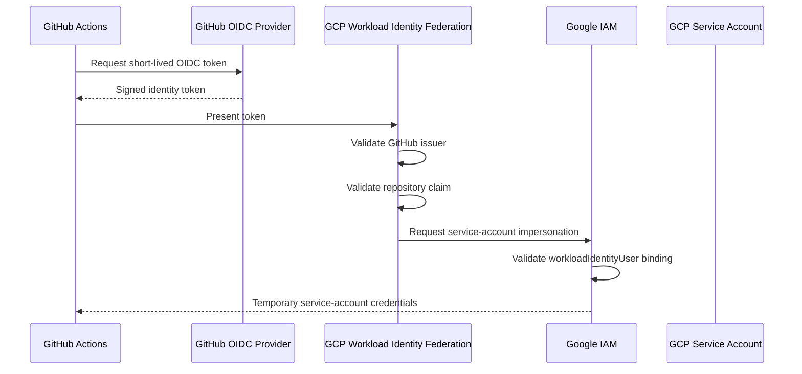
```mermaid
sequenceDiagram
    participant GH as GitHub Actions
    participant OIDC as GitHub OIDC Provider
    participant WIF as GCP Workload Identity Federation
    participant IAM as Google IAM
    participant SA as GCP Service Account

    GH->>OIDC: Request short-lived OIDC token

    OIDC-->>GH: Signed identity token

    GH->>WIF: Present token

    WIF->>WIF: Validate GitHub issuer

    WIF->>WIF: Validate repository claim

    WIF->>IAM: Request service-account impersonation

    IAM->>IAM: Validate workloadIdentityUser binding

    IAM-->>GH: Temporary service-account credentials
```

---

# 16. Terraform Deployment Flow

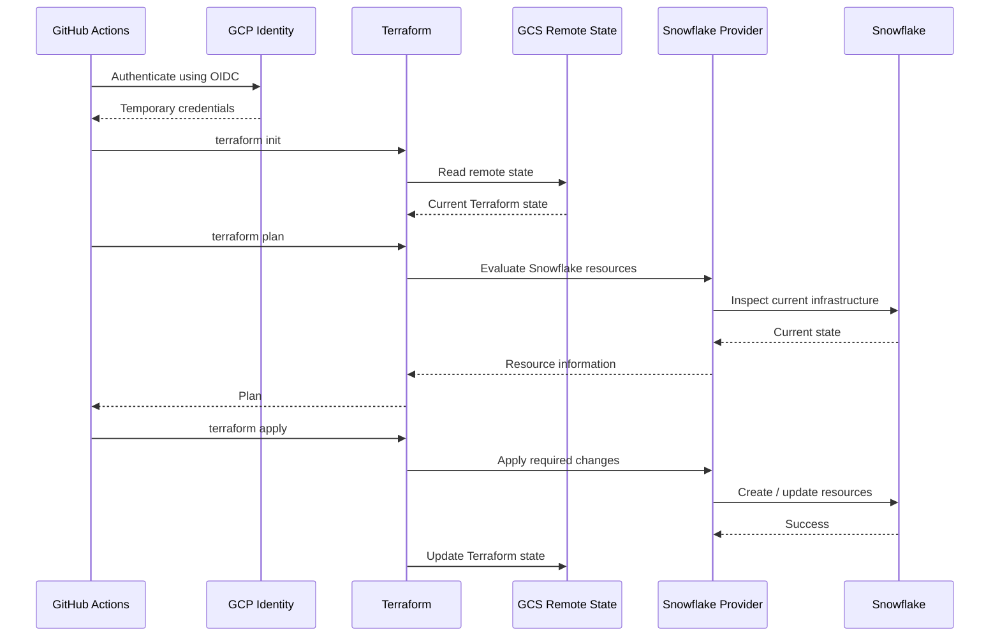
```mermaid
sequenceDiagram
    participant GH as GitHub Actions
    participant GCP as GCP Identity
    participant TF as Terraform
    participant GCS as GCS Remote State
    participant SP as Snowflake Provider
    participant SF as Snowflake

    GH->>GCP: Authenticate using OIDC

    GCP-->>GH: Temporary credentials

    GH->>TF: terraform init

    TF->>GCS: Read remote state

    GCS-->>TF: Current Terraform state

    GH->>TF: terraform plan

    TF->>SP: Evaluate Snowflake resources

    SP->>SF: Inspect current infrastructure

    SF-->>SP: Current state

    SP-->>TF: Resource information

    TF-->>GH: Plan

    GH->>TF: terraform apply

    TF->>SP: Apply required changes

    SP->>SF: Create / update resources

    SF-->>SP: Success

    TF->>GCS: Update Terraform state
```

---

# 17. CI/CD End-to-End Flow

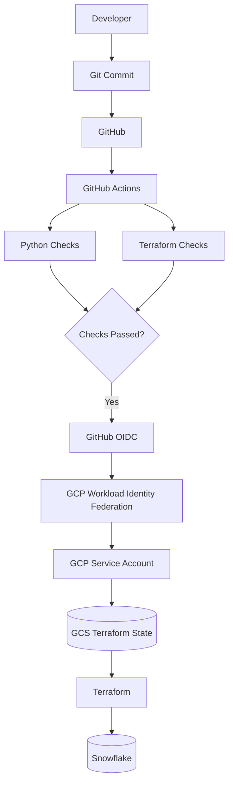
```mermaid
flowchart TD

    DEV[Developer]
        --> GIT[Git Commit]

    GIT
        --> GH[GitHub]

    GH
        --> CI[GitHub Actions]

    CI
        --> PYC[Python Checks]

    CI
        --> TFC[Terraform Checks]

    PYC
        --> DEPLOY{Checks Passed?}

    TFC
        --> DEPLOY

    DEPLOY
        -->|Yes| OIDC[GitHub OIDC]

    OIDC
        --> WIF[GCP Workload Identity Federation]

    WIF
        --> SA[GCP Service Account]

    SA
        --> GCS[(GCS Terraform State)]

    GCS
        --> TF[Terraform]

    TF
        --> SF[(Snowflake)]
```

---

# 18. SQL Safety Failure Flow

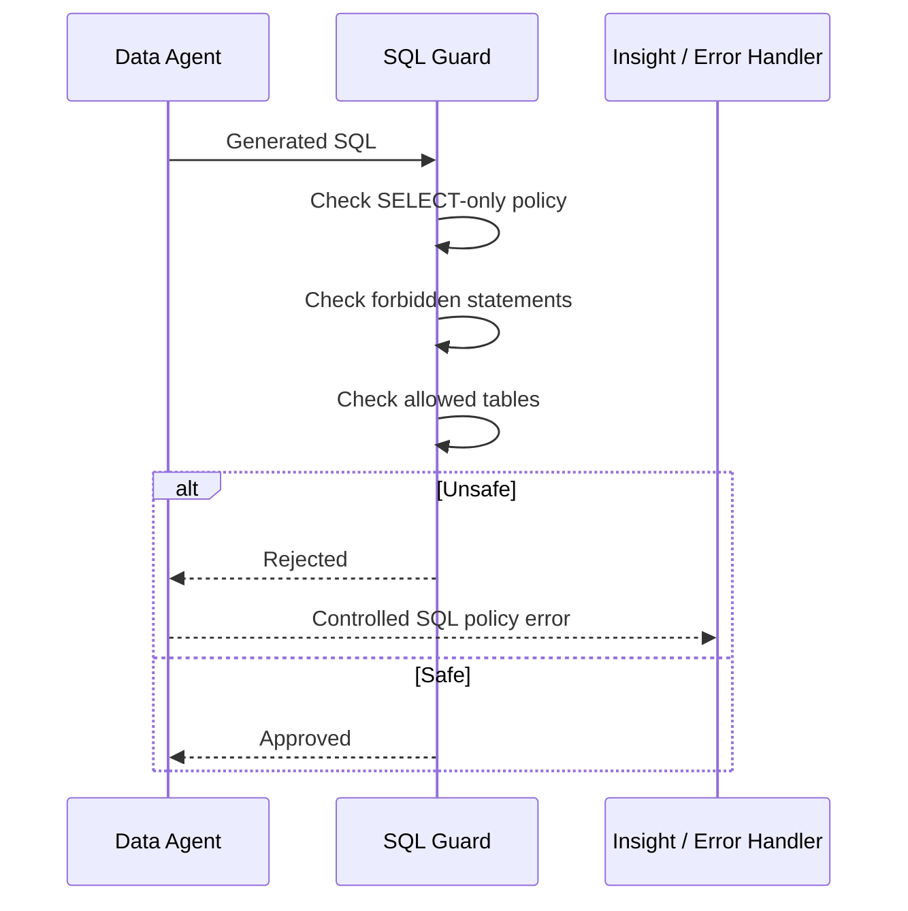
```mermaid
sequenceDiagram
    participant D as Data Agent
    participant G as SQL Guard
    participant I as Insight / Error Handler

    D->>G: Generated SQL

    G->>G: Check SELECT-only policy
    G->>G: Check forbidden statements
    G->>G: Check allowed tables

    alt Unsafe
        G-->>D: Rejected
        D-->>I: Controlled SQL policy error
    else Safe
        G-->>D: Approved
    end
```

---

# 19. SQL Compilation Failure Flow

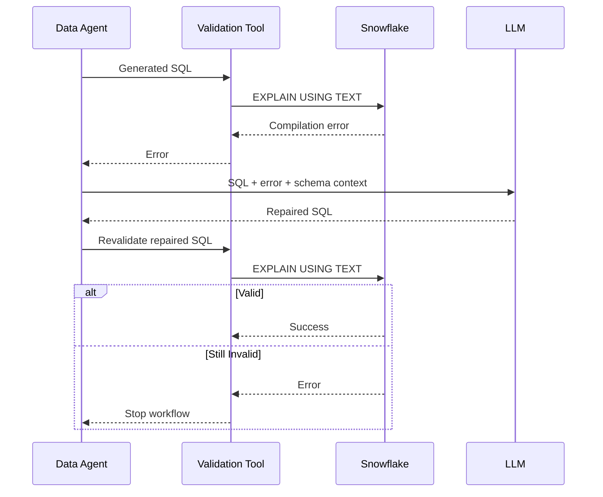
```mermaid
sequenceDiagram
    participant D as Data Agent
    participant V as Validation Tool
    participant SF as Snowflake
    participant L as LLM

    D->>V: Generated SQL

    V->>SF: EXPLAIN USING TEXT

    SF-->>V: Compilation error

    V-->>D: Error

    D->>L: SQL + error + schema context

    L-->>D: Repaired SQL

    D->>V: Revalidate repaired SQL

    V->>SF: EXPLAIN USING TEXT

    alt Valid
        SF-->>V: Success
    else Still Invalid
        SF-->>V: Error
        V-->>D: Stop workflow
    end
```

---

# 20. Empty Result Flow

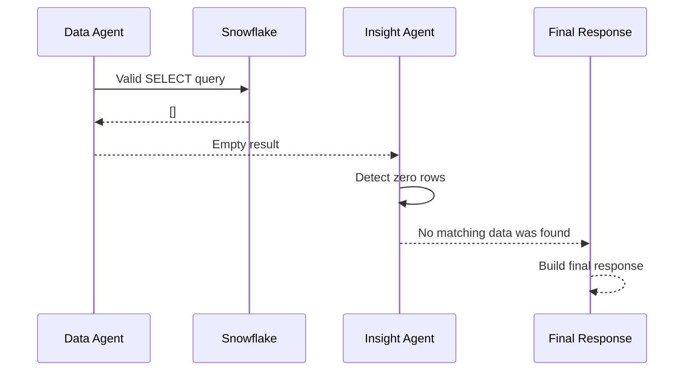
```mermaid
sequenceDiagram
    participant D as Data Agent
    participant SF as Snowflake
    participant I as Insight Agent
    participant F as Final Response

    D->>SF: Valid SELECT query

    SF-->>D: []

    D-->>I: Empty result

    I->>I: Detect zero rows

    I-->>F: No matching data was found

    F-->>F: Build final response
```

---

# 21. Insight Grounding Flow

```mermaid
sequenceDiagram
    participant SF as Snowflake
    participant D as Data Agent
    participant I as Insight Agent
    participant L as LLM

    SF-->>D: Verified analytical rows

    D-->>I: rows + original user question

    I->>I: Add units / metric context

    I->>L: Verified facts only

    L-->>I: Interpretation

    I->>I: Preserve factual values

    I-->>I: Produce grounded insight
```

---

# 22. Separation of Reasoning and Calculation

```mermaid
flowchart LR

    SF[(Snowflake)]
        --> FACTS[Exact Facts]

    FACTS
        --> PY[Python Deterministic Logic]

    PY
        --> VERIFIED[Verified Metrics]

    VERIFIED
        --> LLM[LLM Interpretation]

    LLM
        --> ANSWER[Business Insight]
```

Use:

```text
Snowflake / Python
    for calculations

LLM
    for interpretation
```

---

# 23. Complete State and Tool Interaction

```mermaid
flowchart TD

    Q[User Question]

    Q --> S0[Initial AgentState]

    S0 --> LG[LangGraph Runtime]

    LG --> SUP[Supervisor Node]

    SUP -->|route update| S1[AgentState]

    S1 --> EDGE{Conditional Edge}

    EDGE -->|data_agent| DA[Data Agent]

    DA --> LLM1[LLM Text-to-SQL]

    LLM1 --> CLEAN[SQL Cleaner]

    CLEAN --> GUARD[SQL Guard]

    GUARD --> VALIDATE[Snowflake EXPLAIN Tool]

    VALIDATE --> SF[(Snowflake)]

    VALIDATE -->|valid| QUERY[Snowflake Query Tool]

    QUERY --> SF

    SF -->|rows| QUERY

    QUERY --> DA

    DA -->|sql_result| S2[AgentState]

    S2 --> IA[Insight Agent]

    IA --> LLM2[LLM Interpretation]

    LLM2 --> IA

    IA -->|insight| S3[AgentState]

    S3 --> FR[Final Response Node]

    FR -->|final_answer| S4[Final AgentState]

    S4 --> END[END]
```

---

# 24. Responsibility Map

```text
User
    asks question

Application
    starts graph

LangGraph Runtime
    controls execution

AgentState
    carries workflow information

Supervisor
    decides route

Conditional Edge
    converts route into next graph step

Data Agent
    decides what data is needed

LLM
    proposes SQL

SQL Cleaner
    normalizes generated output

SQL Guard
    enforces application policy

Snowflake EXPLAIN
    validates database correctness

Snowflake Query Tool
    performs database action

Snowflake
    calculates governed facts

Insight Agent
    interprets verified facts

Final Response Node
    prepares user-facing output

END
    terminates execution
```

---

# 25. Core Runtime Summary

The complete execution can be summarized as:

```text
graph.invoke(initial_state)

        ↓

LangGraph Runtime

        ↓

START

        ↓

Supervisor

        ↓

route written into AgentState

        ↓

Conditional Edge

        ↓

Data Agent

        ↓

LLM proposes SQL

        ↓

Deterministic safety controls

        ↓

Snowflake validates SQL

        ↓

Tool executes SQL

        ↓

verified data written into AgentState

        ↓

Insight Agent

        ↓

insight written into AgentState

        ↓

Final Response Node

        ↓

final_answer written into AgentState

        ↓

END

        ↓

graph.invoke() returns final state
```

---

# 26. Architectural Principle

The most important interaction pattern across the entire platform is:

> Reason → validate → execute → observe → interpret.

Agents do not bypass system boundaries.

Every external action passes through an explicit tool, every important decision is represented in state or control flow, and LangGraph remains responsible for coordinating the execution path.
````