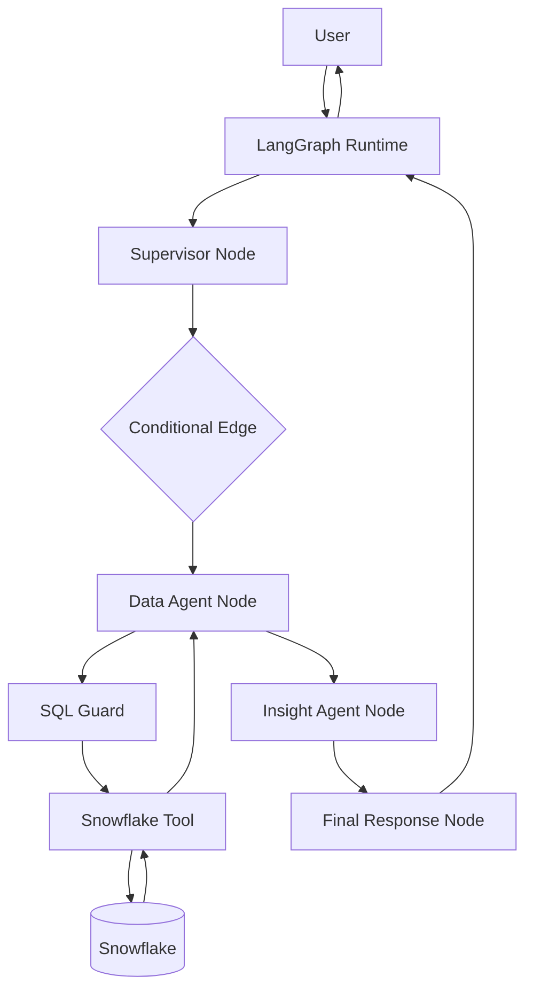

# Architecture & Design Documentation

This directory contains the detailed design documentation for the **Snowflake Agentic Intelligence Platform**.

The goal of these documents is to explain not only what the application does, but also how the underlying components communicate, how LangGraph controls execution, how state flows between nodes, how tools interact with Snowflake, and how the platform handles validation, retries, and safety.

---

## Documentation Map

### 1. End-to-End Architecture

[01-end-to-end-architecture.md](01-end-to-end-architecture.md)

Explains the complete application flow from user request to Snowflake query execution and final AI-generated response.

Covers:

- user entry point
- LangGraph runtime
- supervisor routing
- Data Agent
- Snowflake tool
- Insight Agent
- final response
- component boundaries

---

### 2. Data Platform Flow

[02-data-platform-flow.md](02-data-platform-flow.md)

Explains how data moves through the Snowflake platform.

Covers:

```text
Source
→ Python ingestion
→ Snowflake stage
→ RAW
→ Data Quality
→ CURATED
→ ANALYTICS
→ AI / Agent consumption
```

Includes:

- Snowflake internal stages
- COPY INTO
- file formats
- RAW / CURATED / ANALYTICS responsibilities
- data quality
- SLA risk modeling

---

### 3. CI/CD & Infrastructure Flow

[03-cicd-and-infrastructure-flow.md](03-cicd-and-infrastructure-flow.md)

Explains the infrastructure delivery architecture.

Covers:

```text
Developer
→ GitHub
→ GitHub Actions
→ OIDC
→ GCP Workload Identity Federation
→ GCS Terraform State
→ Terraform
→ Snowflake
```

Includes:

- Terraform state
- CI vs CD
- GitHub OIDC
- GCP service-account impersonation
- secure deployment flow

---

### 4. LangGraph Runtime Internals

[04-langgraph-runtime-internals.md](04-langgraph-runtime-internals.md)

Deep dive into how LangGraph executes the application.

Covers:

- `StateGraph`
- `AgentState`
- nodes
- edges
- conditional edges
- `START`
- `END`
- `compile()`
- `invoke()`
- state merging
- runtime execution

This document explains what actually happens internally when the graph runs.

---

### 5. Supervisor Routing Flow

[05-supervisor-routing-flow.md](05-supervisor-routing-flow.md)

Explains how the Supervisor Agent interprets a user request and chooses the next execution path.

Covers:

- LLM routing
- route values
- shared state updates
- conditional routing
- fallback behavior

---

### 6. Data Agent & Text-to-SQL Flow

[06-data-agent-text-to-sql-flow.md](06-data-agent-text-to-sql-flow.md)

Explains how natural-language analytical questions become governed Snowflake SQL.

Covers:

```text
Question
→ schema context
→ LLM
→ generated SQL
→ sanitization
→ SQL guard
→ Snowflake validation
→ bounded repair
→ execution
```

---

### 7. Snowflake Tool Execution Flow

[07-snowflake-tool-execution-flow.md](07-snowflake-tool-execution-flow.md)

Explains the separation between agent reasoning and real execution.

Covers:

- agent vs tool
- Python execution
- Snowflake connection
- `EXPLAIN USING TEXT`
- query execution
- result return
- resource cleanup

---

### 8. Insight & Final Response Flow

[08-insight-and-final-response-flow.md](08-insight-and-final-response-flow.md)

Explains how verified Snowflake results are converted into user-facing business insights.

Covers:

- deterministic facts
- LLM interpretation
- recommendation generation
- final-response node
- final AgentState

---

### 9. Error Handling & Safety

[09-error-handling-and-safety.md](09-error-handling-and-safety.md)

Explains the controls that prevent unsafe or unreliable agent execution.

Covers:

- SQL allowlisting
- SELECT-only policy
- hallucinated columns
- SQL compilation failures
- bounded retry
- fail-safe behavior
- deterministic validation
- LLM failure modes

---

### 10. Sequence Diagrams

[10-sequence-diagrams.md](10-sequence-diagrams.md)

Contains interaction and sequence diagrams for the major platform flows.

Includes:

- full user-request flow
- LangGraph execution
- Text-to-SQL flow
- SQL repair flow
- CI/CD deployment flow
- data ingestion flow

---

# Core Architectural Principle

The platform follows a strict separation of responsibilities:

```text
LLM
→ reasoning

LangGraph
→ orchestration

State
→ shared workflow context

Nodes
→ executable workflow steps

Conditional Edges
→ routing decisions

Tools
→ real external actions

Snowflake
→ governed data and computation

Python / SQL
→ deterministic logic
```

The guiding principle is:

> LLMs should reason over governed systems, not bypass them.

---

# Component Interaction Overview



---

# Runtime Mental Model

A simplified view of a LangGraph execution:

```text
graph.invoke(initial_state)

        ↓

LangGraph Runtime

        ↓

START

        ↓

Supervisor Node

        ↓

Node returns partial state

        ↓

Runtime merges state

        ↓

Conditional Edge reads updated state

        ↓

Next node executes

        ↓

Tool / Agent processing

        ↓

State continues to evolve

        ↓

END

        ↓

Final AgentState returned
```

---

# Design Goals

The architecture is designed around the following principles:

- governed access to enterprise data
- explicit control flow
- observable agent state
- deterministic validation
- bounded autonomy
- secure tool execution
- separation of reasoning and execution
- reusable platform components
- production-oriented Snowflake integration
```
