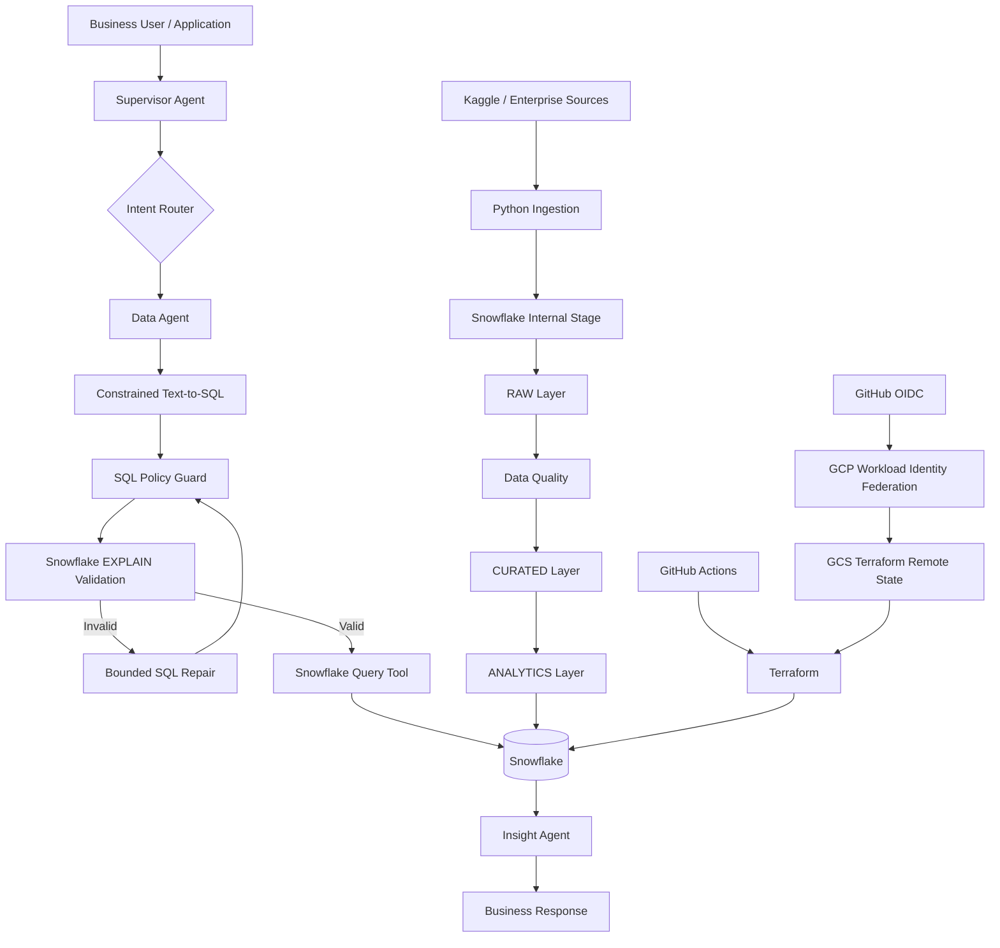

# Snowflake Agentic Intelligence Platform

> A governed Data + AI platform for turning enterprise data in Snowflake into trusted analytics, operational intelligence, and agent-driven decision support.

The **Snowflake Agentic Intelligence Platform** is designed as a reusable enterprise architecture for combining modern data engineering with Generative AI and agentic workflows.

The platform ingests operational data, governs and transforms it through Snowflake data layers, builds deterministic business intelligence, and exposes that data to AI agents through controlled tools.

Instead of allowing an LLM to directly access enterprise databases, the platform introduces explicit layers for:

- data ingestion
- data quality
- analytical modeling
- deterministic business rules
- semantic routing
- guarded Text-to-SQL
- database-native query validation
- tool execution
- AI interpretation
- workflow orchestration
- secure infrastructure deployment

The reference implementation uses **customer support operations** as the business domain, but the architecture is designed to support broader enterprise use cases across operations, finance, supply chain, manufacturing, healthcare, commercial analytics, and internal decision-support systems.

---

# Platform Vision

Enterprise AI should not operate independently from enterprise data systems.

The long-term vision of this platform is to provide a governed intelligence layer over Snowflake where users can interact with enterprise information using natural language while retaining the reliability, security, traceability, and deterministic controls expected from production data platforms.

Instead of:

```text
User
  ↓
LLM
  ↓
Database
```

the platform follows:

```text
User
  ↓
Intent Understanding
  ↓
Agent Orchestration
  ↓
Governed Data Tools
  ↓
Snowflake
  ↓
Verified Results
  ↓
AI Interpretation
  ↓
Decision Support
```

The core philosophy is:

> **LLMs reason. Deterministic systems calculate. Tools execute. Snowflake remains the governed source of truth.**

---

# What the Platform Does

The platform enables users to ask operational questions such as:

```text
Which support channels have the worst average resolution time?

Which issue categories have the highest SLA risk?

Which channels generate the most high-priority tickets?

Where are customer satisfaction scores deteriorating?

Which operational segments require immediate attention?
```

The platform translates those requests into a controlled execution pipeline:

```text
Natural Language Question

        ↓

Supervisor Agent

        ↓

Intent Routing

        ↓

Data Agent

        ↓

Constrained Text-to-SQL

        ↓

SQL Security Validation

        ↓

Snowflake Query Validation

        ↓

Snowflake Execution

        ↓

Verified Data

        ↓

Insight Agent

        ↓

Business Recommendation
```

The objective is not simply to generate answers.

The objective is to produce answers that remain grounded in governed enterprise data.

---

# High-Level Architecture



---

# Platform Layers

The architecture separates responsibilities into distinct layers.

```text
┌─────────────────────────────────────────────┐
│              Experience Layer               │
│ Natural Language / API / Future UI          │
├─────────────────────────────────────────────┤
│             Agentic AI Layer                │
│ Supervisor • Data Agent • Insight Agent     │
├─────────────────────────────────────────────┤
│         Governance & Execution Layer        │
│ SQL Guard • Validation • Tools • Policies   │
├─────────────────────────────────────────────┤
│             Analytics Layer                 │
│ KPIs • SLA Risk • Operational Metrics       │
├─────────────────────────────────────────────┤
│              Data Platform                  │
│ RAW • CURATED • ANALYTICS • AI              │
├─────────────────────────────────────────────┤
│          Infrastructure & Delivery          │
│ Terraform • GitHub Actions • GCS • OIDC     │
└─────────────────────────────────────────────┘
```

Each layer has a specific responsibility and can evolve independently.

---

# Why Snowflake

Snowflake is the central analytical and governed data platform in this architecture.

The platform does not treat Snowflake merely as a database behind an LLM.

Snowflake provides the structured analytical foundation on top of which the AI system operates.

The project demonstrates several important Snowflake capabilities.

---

## Snowflake Database and Schema Isolation

The platform uses a dedicated database:

```text
AI_ENGINEERING_LAB
```

with logical schemas:

```text
AI_ENGINEERING_LAB

├── RAW
├── CURATED
├── ANALYTICS
└── AI
```

Each schema represents a different responsibility.

### RAW

Source-aligned data after ingestion.

Purpose:

- traceability
- replayability
- debugging
- preservation of source structure

### CURATED

Validated and strongly typed business data.

Purpose:

- standardized data types
- data quality enforcement
- reusable analytical datasets
- cleaner downstream contracts

### ANALYTICS

Business-ready derived models.

Purpose:

- operational KPIs
- aggregate metrics
- SLA risk models
- analytical serving

### AI

Designed as the boundary for AI enrichment and AI-produced data products.

This layered model keeps ingestion, business transformation, analytics, and AI concerns separated.

---

# Snowflake Internal Staging

Source files are uploaded into a Snowflake **internal stage** before loading into relational tables.

Pipeline:

```text
Source Dataset
    ↓
Python
    ↓
Snowflake Internal Stage
    ↓
COPY INTO
    ↓
RAW Table
```

Example stage:

```text
@CUSTOMER_SUPPORT_STAGE
```

Internal staging provides a clean boundary between file ingestion and table loading.

---

# Snowflake File Formats

Reusable Snowflake file-format objects define how staged CSV data should be interpreted.

Example:

```sql
CREATE FILE FORMAT CUSTOMER_SUPPORT_CSV_FORMAT
TYPE = CSV
FIELD_OPTIONALLY_ENCLOSED_BY = '"'
SKIP_HEADER = 1;
```

This separates ingestion configuration from individual load commands.

---

# Snowflake COPY INTO

Bulk loading into the RAW layer is performed using Snowflake's native:

```sql
COPY INTO
```

pattern.

Example:

```sql
COPY INTO CUSTOMER_SUPPORT_TICKETS
FROM @CUSTOMER_SUPPORT_STAGE
FILE_FORMAT = CUSTOMER_SUPPORT_CSV_FORMAT;
```

This keeps data ingestion aligned with Snowflake-native bulk-loading patterns rather than performing row-by-row inserts from Python.

---

# Snowflake SQL Transformation

Transformation from RAW to CURATED is executed within Snowflake.

Examples include:

- timestamp parsing
- data typing
- validation rules
- filtering invalid records
- analytical aggregation
- risk classification

This follows an ELT-oriented architecture:

```text
Extract
   ↓
Load into Snowflake
   ↓
Transform inside Snowflake
```

rather than performing every transformation outside the data warehouse.

---

# Data Quality

The platform explicitly validates source data before downstream analytical consumption.

Quality rules include:

- Ticket ID uniqueness
- Required-field validation
- Priority-domain validation
- Satisfaction-score validation
- Non-negative resolution-time validation
- Timestamp parseability

Example validation:

```sql
SELECT
    TICKET_ID,
    COUNT(*)
FROM CUSTOMER_SUPPORT_TICKETS
GROUP BY TICKET_ID
HAVING COUNT(*) > 1;
```

The important design principle is:

> Source quality is measured, not assumed.

Even clean datasets pass through the same validation framework.

---

# Analytical Modeling

The platform converts curated records into reusable analytical models.

Example:

```text
ANALYTICS.SUPPORT_OPERATION_METRICS
```

provides measures such as:

- ticket volume
- average resolution time
- average satisfaction
- high-priority ticket volume
- channel performance
- issue-category performance

This allows AI agents to reason over business-ready analytical structures instead of repeatedly reconstructing raw logic.

---

# Deterministic SLA Risk Engine

Operational risk classification is implemented using deterministic Snowflake SQL rules.

Example:

```text
Critical + resolution > 12 hours
            ↓
         HIGH_RISK

High priority + resolution > 24 hours
            ↓
         HIGH_RISK

Medium priority + resolution > 48 hours
            ↓
        MEDIUM_RISK

Low customer satisfaction
            ↓
        MEDIUM_RISK
```

This is intentionally not delegated to an LLM.

Critical business rules remain deterministic, testable, and explainable.

---

# Snowflake EXPLAIN for Agent Query Validation

One of the most important Snowflake capabilities used by the agent layer is:

```sql
EXPLAIN USING TEXT
```

Before executing LLM-generated SQL, the platform asks Snowflake to compile and validate the query.

This catches errors such as:

- hallucinated columns
- ambiguous identifiers
- malformed SQL
- invalid joins
- incorrect object references

The flow becomes:

```text
LLM SQL
   ↓
Security Validation
   ↓
Snowflake EXPLAIN
   ↓
Compilation Successful?
   ↓
Actual Query Execution
```

This introduces the database engine itself as part of the AI safety and validation architecture.

---

# Agentic Analytics Architecture

The AI layer is orchestrated using **LangGraph**.

LangGraph provides explicit control over:

- shared state
- node execution
- conditional routing
- workflow sequencing
- termination
- future retry policies
- future human-in-the-loop workflows

The graph follows:

```text
START
  ↓
Supervisor
  ↓
Conditional Router
  ↓
Data Agent
  ↓
Snowflake Tool
  ↓
Insight Agent
  ↓
Final Response
  ↓
END
```

---

# Shared Agent State

Agent execution uses an explicit shared state.

```python
class AgentState(TypedDict):
    user_question: str
    route: Optional[str]
    sql_result: Optional[Any]
    insight: Optional[str]
    final_answer: Optional[str]
```

Nodes receive the current state and return updates.

LangGraph manages propagation of those updates throughout the workflow.

This makes execution state explicit rather than hiding workflow context inside individual agents.

---

# Supervisor Agent

The Supervisor Agent interprets user intent and determines what capability is required.

Example:

```text
User:

"Which support channels have the worst average resolution time?"
```

Supervisor decision:

```text
route = data_agent
```

The Supervisor provides semantic routing rather than relying solely on keyword-based conditions.

---

# Data Agent

The Data Agent is responsible for converting analytical intent into a Snowflake query.

The agent receives:

- user question
- allowed schema
- allowed columns
- execution restrictions
- query-generation rules

Example generated query:

```sql
SELECT
    TICKET_CHANNEL,
    AVG(RESOLUTION_TIME_HOURS) AS AVG_RESOLUTION_TIME
FROM AI_ENGINEERING_LAB.CURATED.CUSTOMER_SUPPORT_TICKETS
GROUP BY TICKET_CHANNEL
ORDER BY AVG_RESOLUTION_TIME DESC;
```

The Data Agent proposes the query.

It does not execute database operations directly.

---

# Governed Text-to-SQL

Text-to-SQL is intentionally constrained.

The platform does not use:

```text
User
→ LLM
→ arbitrary SQL
→ production database
```

Instead:

```text
User Question
      ↓
Schema Context
      ↓
LLM SQL Generation
      ↓
Output Sanitization
      ↓
SQL Policy Guard
      ↓
Snowflake Validation
      ↓
Execution Tool
```

The LLM receives only the schema required to answer the question.

This reduces:

- hallucinated columns
- unnecessary joins
- invalid tables
- unpredictable query generation

---

# SQL Policy Guard

Generated SQL must pass deterministic security checks before reaching Snowflake.

The current policy allows analytical:

```text
SELECT
```

operations while rejecting mutation operations such as:

```text
INSERT
UPDATE
DELETE
DROP
ALTER
CREATE
TRUNCATE
MERGE
```

The query must also reference approved analytical objects.

This creates a policy boundary between AI reasoning and database execution.

---

# Bounded SQL Repair

LLMs can produce syntactically valid-looking SQL that the database rejects.

The platform supports a bounded repair workflow:

```text
Generate SQL
      ↓
Policy Validation
      ↓
Snowflake EXPLAIN
      ↓
Compilation Failure
      ↓
Return Error Context to LLM
      ↓
Repair SQL
      ↓
Revalidate
      ↓
Execute or Fail Safely
```

Retries are bounded deliberately.

An autonomous system should not enter uncontrolled reasoning or database retry loops.

---

# Snowflake Query Tool

Actual database execution is isolated inside a Python tool.

Conceptually:

```python
def run_snowflake_query(sql):
    ...
```

The separation is important:

```text
Agent
    decides what should happen

Tool
    performs the real action
```

The LLM itself never opens a Snowflake connection or directly executes SQL.

---

# Insight Agent

Once Snowflake returns verified results, the Insight Agent transforms structured analytical output into business interpretation.

For example, Snowflake may return:

```text
Web Form    39.345 hours
Email       39.258 hours
Chat        39.089 hours
```

The Insight Agent can explain:

```text
Web Form currently has the highest average resolution time.

Operational investigation should therefore prioritize the
Web Form channel before focusing on the smaller differences
between Email and Chat.
```

The important distinction is:

```text
Snowflake / Python
    → facts

LLM
    → interpretation
```

---

# Deterministic Engineering + AI Reasoning

The architecture deliberately separates deterministic computation from semantic reasoning.

## Deterministic Layer

Used for:

- aggregation
- counting
- sorting
- filtering
- percentages
- thresholds
- business rules
- SQL validation
- data quality

Implemented through:

```text
Snowflake SQL
Python
```

## AI Layer

Used for:

- user intent understanding
- semantic routing
- Text-to-SQL generation
- qualitative reasoning
- summarization
- recommendations

Implemented through:

```text
LLM
LangGraph
Ollama
```

This reduces hallucination while retaining the flexibility of natural-language interaction.

---

# Infrastructure as Code

Snowflake infrastructure is managed through Terraform.

Terraform defines core platform infrastructure such as:

```text
AI_ENGINEERING_LAB

RAW
CURATED
ANALYTICS
AI
```

Infrastructure definitions remain version-controlled alongside application and data-engineering code.

---

# Remote Terraform State

Terraform state is stored remotely in Google Cloud Storage.

```text
GCS
↓
Terraform State
↓
Shared Deployment Context
```

This prevents CI/CD from treating each deployment runner as a brand-new infrastructure environment.

It also allows local development and GitHub Actions to operate against the same infrastructure state.

---

# Secure CI/CD with GitHub OIDC

The platform uses GitHub Actions for infrastructure validation and deployment.

Authentication to GCP uses:

```text
GitHub Actions
      ↓
OIDC Token
      ↓
GCP Workload Identity Federation
      ↓
Temporary Service Account Identity
      ↓
GCS Terraform State
```

The architecture intentionally avoids storing long-lived GCP service-account keys inside GitHub.

---

# Continuous Integration

The CI pipeline validates application and infrastructure code.

Python validation includes:

```text
dependency installation
source compilation
syntax checks
```

Terraform validation includes:

```bash
terraform fmt -check
terraform init -backend=false
terraform validate
```

CI validation does not need access to production Terraform state.

---

# Continuous Deployment

Deployments from the main branch follow:

```text
Git Push
   ↓
GitHub Actions
   ↓
Python Validation
   ↓
Terraform Validation
   ↓
OIDC Authentication
   ↓
GCS Remote State
   ↓
Terraform Plan
   ↓
Terraform Apply
   ↓
Snowflake
```

The result is a secure infrastructure delivery path without persistent cloud credentials.

---

# Reference Business Domain

The current reference domain is **Customer Support Operations Intelligence**.

The dataset contains approximately:

```text
20,000 support tickets
```

with attributes including:

- customer information
- ticket descriptions
- issue category
- priority level
- communication channel
- submission date
- resolution time
- assigned agent
- customer satisfaction

This domain provides a realistic environment for demonstrating:

- ingestion
- analytics engineering
- SLA management
- operational KPIs
- natural-language analytics
- Text-to-SQL
- AI interpretation

The architecture itself is intentionally domain-neutral.

The same platform pattern can be adapted to:

```text
Supply Chain Intelligence
Finance Analytics
Manufacturing Operations
Healthcare Operations
Commercial Analytics
Risk & Compliance
Enterprise Knowledge Systems
IT Service Management
```

---

# Technology Stack

| Capability | Technology |
|---|---|
| Cloud Data Platform | Snowflake |
| SQL Analytics | Snowflake SQL |
| Data Staging | Snowflake Internal Stage |
| Bulk Loading | Snowflake COPY INTO |
| Query Validation | Snowflake EXPLAIN |
| Data Engineering | Python |
| Infrastructure as Code | Terraform |
| Infrastructure State | Google Cloud Storage |
| CI/CD | GitHub Actions |
| CI/CD Authentication | GitHub OIDC |
| Cloud Identity | GCP Workload Identity Federation |
| Agent Orchestration | LangGraph |
| LLM Runtime | Ollama |
| Language Model | Mistral |
| Source Integration | Kaggle API |
| Version Control | Git / GitHub |

---

# Repository Structure

```text
snowflake-engineering-lab/

├── .github/
│   └── workflows/
│       └── ci.yml
│
├── python/
│   ├── agent_state.py
│   ├── data_agent.py
│   ├── db.py
│   ├── final_response.py
│   ├── ingest_support_data.py
│   ├── insight_agent.py
│   ├── langgraph_flow.py
│   ├── llm_client.py
│   ├── snowflake_tool.py
│   ├── sql_guard.py
│   └── supervisor_node.py
│
├── sql/
│   ├── 04_create_customer_support_raw.sql
│   ├── 05_load_customer_support_raw.sql
│   ├── 06_create_customer_support_curated.sql
│   ├── 07_data_quality_checks.sql
│   ├── 08_create_support_analytics.sql
│   └── 09_create_sla_risk.sql
│
├── terraform/
│   ├── main.tf
│   ├── providers.tf
│   └── variables.tf
│
└── README.md
```

---

# Design Principles

## Snowflake as the Source of Truth

AI consumes governed data rather than creating an independent parallel data universe.

## AI Does Not Bypass Governance

Agents interact through controlled tools and policies.

## Deterministic Before Probabilistic

Calculations and business rules remain deterministic whenever possible.

## Explicit State

Agent execution context is visible and controlled through LangGraph state.

## Least-Privilege Execution

Database capabilities exposed to agents are deliberately constrained.

## Validate Before Execute

Generated SQL must satisfy application policy and database-native validation.

## Bounded Autonomy

Retries and repair loops have explicit limits.

## Infrastructure Is Code

Platform infrastructure is version-controlled and reproducibly deployed.

## Short-Lived Credentials

CI/CD relies on federated identity rather than static cloud keys.

---

# Platform Direction

The architecture is designed to evolve into a broader enterprise intelligence platform capable of combining:

```text
Structured Analytics
+
Enterprise Documents
+
RAG
+
Agentic Workflows
+
Human-in-the-Loop Decisions
+
Operational Automation
```

A future interaction could therefore evolve from:

```text
"What is our SLA risk?"
```

to:

```text
"Identify the highest-risk support areas,
explain the underlying operational drivers,
check the relevant support policy,
recommend corrective actions,
and prepare an escalation summary."
```

At that point the platform becomes more than a conversational analytics interface.

It becomes an **enterprise decision-intelligence system built around governed data, tools, policies, and AI agents.**

---

# Engineering Philosophy

> **Build AI around trustworthy systems rather than replacing trustworthy systems with AI.**

Snowflake provides the governed data foundation.

Terraform provides reproducible infrastructure.

GitHub Actions provides automated delivery.

Federated identity provides secure authentication.

LangGraph provides controlled agent orchestration.

Tools provide executable capabilities.

LLMs provide semantic reasoning.

Together, they form a platform where AI can operate on enterprise data without removing the engineering controls required for reliable systems.